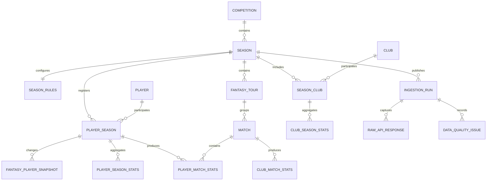

# Data model discovery

This document records facts observed against the live Sports.ru GraphQL API on
2026-07-19. The endpoint is internal and undocumented, so every assumption must
remain covered by a live contract check.

## Confirmed source objects

| Source object | Observed identifier | Storage grain |
| --- | --- | --- |
| Fantasy tournament | `1` / `russia` | Competition |
| Completed season | Fantasy `59`, stat `rfpl_25-26` | Season |
| Active season | Fantasy `75`, stat `rfpl_26-27` | Season |
| Fantasy team | Numeric string, for example `10` | Club within season |
| Stat team | Slug, for example `fc_krasnodar` | Cross-season club candidate |
| Fantasy player | Numeric string, for example `54138` | Player within season |
| Stat player | Slug, for example `eduard_spertsyan` | Cross-season player candidate |
| Fantasy tour | Numeric string | Tour within season |
| Stat match | Numeric string | Match |

Stat slugs are useful for joining seasons, but they are still external
identifiers rather than guaranteed immutable primary keys. Internal surrogate
keys are used throughout the proposed schema.

## Observed volume for 2025/2026

- 16 clubs
- 30 fantasy tours
- 240 matches
- 590 fantasy player records

The player count includes records without meaningful playing time and may
include players who left the tournament. Analytics training sets must filter by
minutes and availability rather than assuming every catalog entry is active.

## Entity relationships

## Why the grains are separate

### Player and player season

`FantasySeasonPlayer` combines identity, season registration and mutable
fantasy state. It is split into:

- `players`: candidate cross-season identity from `statObject.id`;
- `player_seasons`: fantasy ID, season and role;
- `fantasy_player_snapshots`: price, club, status, ownership and form;
- `player_season_stats`: aggregates captured by an ingestion run;
- `player_match_stats`: one row per player and match.

This supports transfers between clubs and prevents a refresh from overwriting
the values used by an earlier model run.

### Club and season club

Fantasy team IDs and stat team IDs use different namespaces. `clubs` stores the
stat identity candidate, while `season_clubs` stores the fantasy identity and
season-specific display name.

### Rules and constraints

The checked 2025/2026 season had:

- budget 100;
- roster 2 goalkeepers, 5 defenders, 5 midfielders and 3 forwards;
- 11 starting players;
- usually 3 transfers per tour;
- usually at most 3 players from one club;
- 6 transfers in tour 19.

These values demonstrably vary by tour. Optimizer constraints must come from
`season_rules` and `fantasy_tours`, never constants.

## Field mapping

| GraphQL path | Proposed table |
| --- | --- |
| `tournament` | `competitions` |
| `tournament.seasons` | `seasons` |
| `season.info.constraints` and `season.rules` | `season_rules` |
| `season.info.teams` | `clubs`, `season_clubs` |
| `season.tours` | `fantasy_tours` |
| `tour.matches` | `matches` |
| `players.list` | `players`, `player_seasons` |
| `player.price`, `status`, `seasonScoreInfo` | `fantasy_player_snapshots` |
| `player.gameStat` | `player_season_stats` |
| `player.matches.playerMatchInfo` | `player_match_stats` |
| `player.matches.statDetails` | `fantasy_point_details` |
| `stat_season.stats(id)` | `club_season_stats` |
| Derived match scores | `club_match_stats`, `club_season_stats` |
| Quality-gate violations (step 4) | `data_quality_issues` |

## Extended match statistics

Step 3 probed the `statQueries.football.match(id)` operation against a
reproducible sample of 40 finished 2025/2026 matches (all 16 clubs, all 30
tours). The full coverage table lives in
[`docs/match-stats-coverage.md`](match-stats-coverage.md); the highlights are:

- `statQueries.football.match(id: <stat_match_id>)` resolves a `statMatch`
  without a `source` argument, so the `matches.stat_match_id` already imported is
  a sufficient key.
- Availability flags `hasDetailStat`, `hasLineups`, `hasEvents` and
  `hasPersonStat` were true for all 40 matches; `hasXG` was true for only 10.
- Team match stats (`statTeamMatchStat`) reliably expose shots (total, on/off
  target, blocked, saved), `ballPossession`, `cornerKicks`, `fouls`,
  `freeKicks`, `goalKicks`, `throwIns`, `substitutions` and `penaltyScored`.
  Cards, `offsides` and `ownGoals` are partial; `injuries` is always null.
- Per-player match stats (`statPlayerMatchStat`) are far sparser. Only
  `goalsScored`, `ownGoals`, `yellowCards`, `yellowRedCards`, `redCards` and
  `chancesCreated` are always present. Minutes, marks and ball recovery are
  partial; passing splits, duel totals, `xG`/`xA`, `performanceScore` and most
  advanced metrics are null and must be excluded.
- Lineups always return 11 starters per side plus bench, with `player.id`,
  `jerseyNumber`, `lineupStarting`, `lineupOrder`, `isCaptain` and `formation`.
  `position` is only filled for starters.
- The event timeline (`events`) is complete for id, time, type and outcome; the
  attacking `team` qualifier (`HOME`/`AWAY`) is present for ~77% of events.
- xG (`statTeamMatch.xG` and player `xG`/`xA`/`xGPS`) is unreliable for RPL and
  must stay optional.

### Fantasy ↔ stat identifiers

The extended stats join back to the imported catalog through stat slugs:

- `statMatch.home/away.team.id` is the stat team slug (`clubs.stat_team_id`).
- `statMatch.home/away.lineup[].player.id` is the stat player slug
  (`players.stat_player_id`).
- The match itself is keyed by `matches.stat_match_id`.

### Proposed model impact (not implemented in step 3)

A future extended-stats table should store per-team and per-player rows keyed by
the internal match surrogate, persisting only the reliably-populated fields
above and keeping the raw payload for the sparse metrics. No schema change is
made yet; this spike is investigation only.

## Data quality findings

1. `statDetails` was empty in sampled completed matches. Exact point
   decomposition cannot depend on it until broader coverage is checked.
2. `statTeamSeasonStat.YellowCards` and `RedCards` returned zero for the tested
   club season. Those fields require reconciliation before use.
3. The fantasy aggregate has no explicit match count or clean-sheet field.
   Match count comes from player history; clean sheets must be derived.
4. Historical injury/status snapshots are not exposed by the tested queries.
   They can only be accumulated during future manual refreshes.
5. Fantasy and stat APIs are related through `statObject`, but their IDs belong
   to different namespaces.
6. Sports.ru freezes fantasy statistics 72 hours after the final match of a
   tour, so recently completed tours can still change.

## Data quality gate (step 4)

`fantasy-quality` evaluates the snapshot of an ingestion run before analytics
depend on it. Violations are stored in `data_quality_issues` (scoped to the run,
with the `expected`/`actual` value behind each comparison), and the run is
published by toggling `ingestion_runs.is_active`. A partial unique index
guarantees at most one active run per season, and a run with any blocking issue
never becomes active, so an invalid snapshot cannot supersede the last valid
one.

| Check | Severity | Expected vs actual |
| --- | --- | --- |
| `catalog_completeness` | blocking | season exposes clubs, tours, matches and players (each `> 0`) |
| `reference_integrity` | blocking | every match/player references clubs registered in the season and home ≠ away |
| `duplicate_fixtures` | blocking | each `(tour, home, away)` fixture appears once |
| `match_score_completeness` | warning | matches older than the 72h window carry a final score |
| `club_result_reconciliation` | blocking / warning | club season aggregate = results derived from `club_match_stats` |
| `player_points_reconciliation` | blocking / warning | season fantasy total = sum of per-match stats; minutes without history is blocking |

Reconciliation mismatches are downgraded from blocking to `warning` when they
involve a match inside the 72-hour adjustment window, because Sports.ru can
still revise those results. On the completed 2025/2026 season all 16 clubs and
590 players reconcile exactly, so the checks do not false-positive on a
well-formed snapshot.

## Questions left for the next discovery iteration

- Which `statMatch` fields reliably expose shots, possession, xG and lineups for
  every RPL match? — Answered in step 3, see "Extended match statistics" above:
  shots, possession, corners, fouls and lineups are reliable; xG and most
  advanced player metrics are not.
- Can player match histories be fetched efficiently in batches without one
  request per player? — Partially: `statQueries.football.matches(ids: [ID!]!)`
  and `statMatch.home/away.lineup[].stat` return every player in one match
  request, so extended stats need one call per match rather than per player.
- How frequently are player ownership and form updated?
- Are stat player and team slugs preserved after renames or transfers?
- Which event fields reproduce fantasy assists and ball recoveries?
- Are current-season suspensions and injuries complete enough for expected
  minutes modeling?

The prototype intentionally keeps raw responses so these questions can be
answered without losing the source payload that led to a schema decision.
