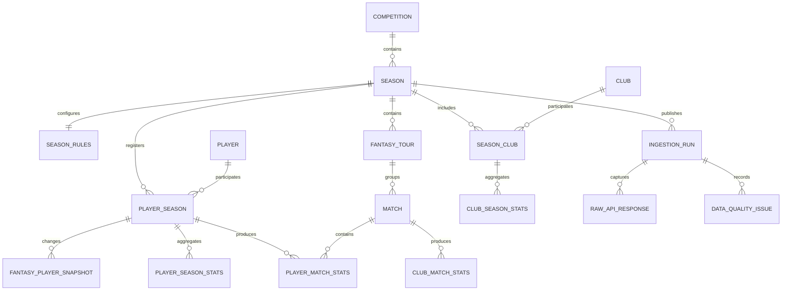

# Data model discovery

This document records facts observed against the live Sports.ru GraphQL API on
2026-07-19. The endpoint is internal and undocumented, so every assumption must
remain covered by a live contract check.

## Confirmed source objects

| Source object | Observed identifier | Storage grain |
| --- | --- | --- |
| Fantasy tournament | `1` / `russia` | Competition |
| Completed season | Fantasy `59`, stat `rfpl_25-26` | Season |
| Active season | Fantasy `75`, stat `rfpl_26-27` | Season |
| Fantasy team | Numeric string, for example `10` | Club within season |
| Stat team | Slug, for example `fc_krasnodar` | Cross-season club candidate |
| Fantasy player | Numeric string, for example `54138` | Player within season |
| Stat player | Slug, for example `eduard_spertsyan` | Cross-season player candidate |
| Fantasy tour | Numeric string | Tour within season |
| Stat match | Numeric string | Match |

Stat slugs are useful for joining seasons, but they are still external
identifiers rather than guaranteed immutable primary keys. Internal surrogate
keys are used throughout the proposed schema.

## Observed volume for 2025/2026

- 16 clubs
- 30 fantasy tours
- 240 matches
- 590 fantasy player records

The player count includes records without meaningful playing time and may
include players who left the tournament. Analytics training sets must filter by
minutes and availability rather than assuming every catalog entry is active.

## Entity relationships

## Why the grains are separate

### Player and player season

`FantasySeasonPlayer` combines identity, season registration and mutable
fantasy state. It is split into:

- `players`: candidate cross-season identity from `statObject.id`;
- `player_seasons`: fantasy ID, season and role;
- `fantasy_player_snapshots`: price, club, status, ownership and form;
- `player_season_stats`: aggregates captured by an ingestion run;
- `player_match_stats`: one row per player and match.

This supports transfers between clubs and prevents a refresh from overwriting
the values used by an earlier model run.

### Club and season club

Fantasy team IDs and stat team IDs use different namespaces. `clubs` stores the
stat identity candidate, while `season_clubs` stores the fantasy identity and
season-specific display name.

### Rules and constraints

The checked 2025/2026 season had:

- budget 100;
- roster 2 goalkeepers, 5 defenders, 5 midfielders and 3 forwards;
- 11 starting players;
- usually 3 transfers per tour;
- usually at most 3 players from one club;
- 6 transfers in tour 19.

These values demonstrably vary by tour. Optimizer constraints must come from
`season_rules` and `fantasy_tours`, never constants.

## Field mapping

| GraphQL path | Proposed table |
| --- | --- |
| `tournament` | `competitions` |
| `tournament.seasons` | `seasons` |
| `season.info.constraints` and `season.rules` | `season_rules` |
| `season.info.teams` | `clubs`, `season_clubs` |
| `season.tours` | `fantasy_tours` |
| `tour.matches` | `matches` |
| `players.list` | `players`, `player_seasons` |
| `player.price`, `status`, `seasonScoreInfo` | `fantasy_player_snapshots` |
| `player.gameStat` | `player_season_stats` |
| `player.matches.playerMatchInfo` | `player_match_stats` |
| `player.matches.statDetails` | `fantasy_point_details` |
| `stat_season.stats(id)` | `club_season_stats` |
| Derived match scores | `club_match_stats`, `club_season_stats` |
| Quality-gate violations (step 4) | `data_quality_issues` |
| Points forecasts (step 7), cross-season source (step 14) | `player_forecasts` |

## Extended match statistics

Step 3 probed the `statQueries.football.match(id)` operation against a
reproducible sample of 40 finished 2025/2026 matches (all 16 clubs, all 30
tours). The full coverage table lives in
[`docs/match-stats-coverage.md`](match-stats-coverage.md); the highlights are:

- `statQueries.football.match(id: <stat_match_id>)` resolves a `statMatch`
  without a `source` argument, so the `matches.stat_match_id` already imported is
  a sufficient key.
- Availability flags `hasDetailStat`, `hasLineups`, `hasEvents` and
  `hasPersonStat` were true for all 40 matches; `hasXG` was true for only 10.
- Team match stats (`statTeamMatchStat`) reliably expose shots (total, on/off
  target, blocked, saved), `ballPossession`, `cornerKicks`, `fouls`,
  `freeKicks`, `goalKicks`, `throwIns`, `substitutions` and `penaltyScored`.
  Cards, `offsides` and `ownGoals` are partial; `injuries` is always null.
- Per-player match stats (`statPlayerMatchStat`) are far sparser. Only
  `goalsScored`, `ownGoals`, `yellowCards`, `yellowRedCards`, `redCards` and
  `chancesCreated` are always present. Minutes, marks and ball recovery are
  partial; passing splits, duel totals, `xG`/`xA`, `performanceScore` and most
  advanced metrics are null and must be excluded.
- Lineups always return 11 starters per side plus bench, with `player.id`,
  `jerseyNumber`, `lineupStarting`, `lineupOrder`, `isCaptain` and `formation`.
  `position` is only filled for starters.
- The event timeline (`events`) is complete for id, time, type and outcome; the
  attacking `team` qualifier (`HOME`/`AWAY`) is present for ~77% of events.
- xG (`statTeamMatch.xG` and player `xG`/`xA`/`xGPS`) is unreliable for RPL and
  must stay optional.

### Fantasy ↔ stat identifiers

The extended stats join back to the imported catalog through stat slugs:

- `statMatch.home/away.team.id` is the stat team slug (`clubs.stat_team_id`).
- `statMatch.home/away.lineup[].player.id` is the stat player slug
  (`players.stat_player_id`).
- The match itself is keyed by `matches.stat_match_id`.

### Proposed model impact (not implemented in step 3)

A future extended-stats table should store per-team and per-player rows keyed by
the internal match surrogate, persisting only the reliably-populated fields
above and keeping the raw payload for the sparse metrics. No schema change is
made yet; this spike is investigation only.

## Data quality findings

1. `statDetails` was empty in sampled completed matches. Exact point
   decomposition cannot depend on it until broader coverage is checked.
2. `statTeamSeasonStat.YellowCards` and `RedCards` returned zero for the tested
   club season. Those fields require reconciliation before use.
3. The fantasy aggregate has no explicit match count or clean-sheet field.
   Match count comes from player history; clean sheets must be derived.
4. Historical injury/status snapshots are not exposed by the tested queries.
   They can only be accumulated during future manual refreshes.
5. Fantasy and stat APIs are related through `statObject`, but their IDs belong
   to different namespaces.
6. Sports.ru freezes fantasy statistics 72 hours after the final match of a
   tour, so recently completed tours can still change.

## Data quality gate (step 4)

`fantasy-quality` evaluates the snapshot of an ingestion run before analytics
depend on it. Violations are stored in `data_quality_issues` (scoped to the run,
with the `expected`/`actual` value behind each comparison), and the run is
published by toggling `ingestion_runs.is_active`. A partial unique index
guarantees at most one active run per season, and a run with any blocking issue
never becomes active, so an invalid snapshot cannot supersede the last valid
one.

| Check | Severity | Expected vs actual |
| --- | --- | --- |
| `catalog_completeness` | blocking | season exposes clubs, tours, matches and players (each `> 0`) |
| `reference_integrity` | blocking | every match/player references clubs registered in the season and home ≠ away |
| `duplicate_fixtures` | blocking | each `(tour, home, away)` fixture appears once |
| `match_score_completeness` | warning | matches older than the 72h window carry a final score |
| `club_result_reconciliation` | blocking / warning | club season aggregate = results derived from `club_match_stats` |
| `player_points_reconciliation` | blocking / warning | season fantasy total = sum of per-match stats; minutes without history is blocking |

Reconciliation mismatches are downgraded from blocking to `warning` when they
involve a match inside the 72-hour adjustment window, because Sports.ru can
still revise those results. On the completed 2025/2026 season all 16 clubs and
590 players reconcile exactly, so the checks do not false-positive on a
well-formed snapshot.

## Manual ingestion jobs (step 5)

The admin API (`fantasy-api`) turns a refresh into a persisted job rather than a
synchronous request. `POST /admin/ingestion/rpl/refresh` inserts a row into
`ingestion_jobs` (status `pending`) and returns `202` with the job id
immediately; a separate worker process (`fantasy-ingestion-worker`) runs the
import plus the quality gate and drives the job through
`running → succeeded`/`failed`. `GET /admin/ingestion/runs/{id}` reads a job
back by that id, so its status survives an API restart. There is no Redis: a
partial unique index and a session-level advisory lock replace it.

| Concern | Mechanism |
| --- | --- |
| At most one active refresh per tournament | partial unique index `ingestion_jobs_active_tournament_idx` on `tournament_slug` where `status IN ('pending','running')` |
| No overlapping imports even under a race | worker holds `pg_try_advisory_lock(key)` keyed by the tournament for the whole run |
| Status persistence across restarts | job lifecycle and `result` live in `ingestion_jobs` |
| Safe error surface | `error_message` stores a bounded, credential-redacted description |
| Data freshness | `result.data_freshness` = the published run's `finished_at`, set only when the snapshot passes the quality gate |

The job's `result` JSONB embeds the import report, the full quality report and
the derived freshness/`snapshot_active` flags. `ingestion_run_id` links the job
to the `IngestionRun` it produced once the worker starts the import.

## Analytical features (step 6)

`fantasy-features` builds a reproducible, leakage-free dataset for a target tour
from the active snapshot. It reads only the domain tables of one ingestion run
and never calls the Sports.ru API or writes to the database, so step 6 adds no
schema. The full field list and missing-value strategy live in
[`docs/feature-dictionary.md`](feature-dictionary.md); the design points that
touch the data model are:

- **Snapshot source.** Features read run-scoped facts (`player_match_stats`,
  `club_match_stats`, `fantasy_player_snapshots`) filtered by the active run's
  `ingestion_run_id`, joined to the shared catalog (`player_seasons`, `players`,
  `season_clubs`, `matches`, `fantasy_tours`).
- **Cutoff and leakage.** The cutoff is the target tour's
  `transfers_deadline_at` (falling back to `starts_at`, then earliest fixture
  kickoff). Only matches with `scheduled_at < cutoff` are used, and matches
  belonging to the target tour are excluded from history explicitly as a second
  guard against a mis-dated deadline.
- **Appearances vs. starts.** `player_match_stats` rows approximate appearances
  (history is imported only for players with minutes). There is no imported
  lineup flag, so a "start" is approximated as `field_minutes >= 60`; both the
  appearance and start shares are measured against the club's matches before the
  cutoff.
- **Club strength.** Home/away attack and defence are per-match goals for/against
  derived from `club_match_stats` before the cutoff, with the league mean used as
  the fallback when a club has no matches at a venue yet.
- **Availability.** Point-in-time `availability_status` from the active snapshot
  drives `is_available`; `INJURY`/`SUSPENDED`/etc. zero the appearance
  probability and expected minutes.

## Baseline points forecast (step 7)

`fantasy-forecast` turns the leakage-free feature dataset into an expected
number of fantasy points for every player whose club plays a target tour, and
persists the result to `player_forecasts`. The design points that touch the data
model are:

- **Snapshot and versioning.** Every forecast row is keyed to the data snapshot
  (`ingestion_run_id`), the target `tour_id`/`match_id`, the `player_season_id`,
  the model (`model_name` + `model_version`), the `feature_version` and the
  `scoring_version`. A unique constraint on
  `(ingestion_run_id, tour_id, model_name, model_version, player_season_id,
  match_id)` makes re-runs idempotent, and the additive `components` JSONB always
  sums to `expected_points`. `params` records the model's intermediate
  expectations. Three models are stored per player: the interpretable event
  model (`poisson_events`) plus two baselines (`season_mean`, `recent_form`).
- **Scoring rules.** Sports.ru only publishes the fantasy scoring rules as an
  image, and the structured per-event breakdown (`statDetails`) is empty, so the
  scoring table (`SCORING`, version `rpl-2025-2026.1`) was reconstructed from the
  season's own authoritative per-match `points`. Reconstructing the 9578
  imported player-match rows from the table reproduces 83% exactly and 96%
  within ±1 point. The residual is dominated by the indirect "fantasy assist"
  and late ball-recovery corrections, which are not present in the imported
  per-match columns (see "Data quality findings" 1 and 6). Confirmed rules:
  appearance +1 (1–59') / +2 (≥60'); goal GK/DEF +6, MID +5, FWD +4; assist +3;
  clean sheet (full appearance, opponent scoreless) GK/DEF +4, MID +1, FWD 0;
  goals conceded −1 per 2 (GK/DEF); ball recovery +1 per 3; goalkeeper save
  +1 per 3; yellow −1.
- **Team goals via Poisson.** Each club's goals for/against are Poisson means
  blended from the venue attack/defence features
  (`0.5 * (club_attack + opponent_defense)` and the mirror), and the clean-sheet
  probability is the Poisson probability that the opponent fails to score.
- **Read-only inputs.** Forecasting only reads the feature dataset (which itself
  only reads one ingestion run) and writes `player_forecasts`; it never calls the
  Sports.ru API. The computation is pure arithmetic, so recomputing on the same
  snapshot is deterministic.

## Squad optimizer (step 8)

`fantasy-optimize` turns the expected-points forecast into a valid fantasy squad
for a target tour. It is an integer program solved with OR-Tools CP-SAT and adds
no schema (it only reads the forecast/feature path). The design points that
touch the data model are:

- **Rules come from the database.** The budget (`season_rules.total_budget`), the
  squad size (`total_players`), the starting size (`starting_players`) and the
  per-role squad/starting limits (`full_roster_constraints` /
  `starting_roster_constraints`, each a list of
  `{role, minCount, maxCount}`) are read from `season_rules`. The club limit
  (`fantasy_tours.max_same_team_players`) and the transfer limit
  (`fantasy_tours.total_transfers`) come from the target tour. Because these
  demonstrably vary by season and tour, none of them is hard-coded.
- **Decision variables.** Binary `pick` (in the 15-man squad), `start` (in the
  starting eleven) and `captain` variables, with `start <= pick`,
  `captain <= start` and exactly one captain. Per-role squad and starting counts
  are bounded by the parsed limits, total spend by the budget, and per-club
  picks by the club limit. The vice-captain is the best remaining starter and the
  bench is ordered by expected points with the reserve keeper last.
- **Objective.** Maximise `sum(expected_points * start) + expected_points(captain)`
  — the fantasy scoring of a lineup with the captain counted twice — with a
  strict secondary tie-break that minimises spend (maximising unused budget). A
  single search worker and a fixed random seed make the same inputs deterministic.
- **Two modes.** With no current squad the optimizer builds a fresh roster; given
  a `current_squad` (fantasy ids) it keeps at least `total_players - transfers`
  of the present players, so at most the transfer limit is spent. Players missing
  from the candidate pool are reported as forced transfers.
- **Independent validation.** `validate_squad` re-checks every rule on the
  produced solution without trusting the solver, so a model bug surfaces as a
  validation failure rather than an invalid squad, and an infeasible problem
  raises a clear `OptimizerError`.

### Pinned players and formations (step 15)

The same program also accepts the user's own choices, so the optimizer completes
a partially assembled squad instead of replacing it. No schema changes.

- **Pins.** `locked_ids` adds `pick[i] == 1` and `locked_starter_ids` adds
  `start[i] == 1` (which implies `pick`), so the two sets are merged before the
  model is built. Every other constraint is untouched, so the remaining slots are
  still filled optimally; pinning players the free optimum already picked
  reproduces the free optimum exactly.
- **Formations.** `formation` is given as defenders-midfielders-forwards
  (`"4-4-2"`); the goalkeepers are whatever is left of the starting eleven.
  `parse_formation` rejects a shape the season's `starting_roster_constraints`
  cannot play, and the per-role starting bounds are replaced by equalities.
- **Conflicts are named, not just "infeasible".** Pin sets are validated against
  the rules *before* solving, so exceeding a positional or club limit, spending
  the budget on the pins alone, pinning more players than the roster holds or
  pinning starters a requested formation cannot field each raise an
  `OptimizerError` naming the conflicting constraint. Pins that reference a
  player outside the candidate pool are an error too (unlike `current_squad`,
  where an unknown id is simply a forced transfer out).
- **Provenance.** Each squad entry carries `is_locked`, the solution carries a
  `constraints` block (`locked`, `locked_starters`, `formation`), and
  `validate_squad` re-checks the pins and the formation independently, so a lock
  silently dropped by the model would surface as a validation failure.

### Fixture-aware objective (step 16)

The tour's own schedule is part of the objective, so a squad does not bet on both
sides of the same match. No schema changes; the inputs are the `match_id` /
`club_id` already carried by every forecast row plus two derived exposures.

- **Exposures.** The event forecast reports `params.fixture.goal_upside` (the
  points that only materialise when the player's own club scores: goals plus
  assists) and `params.fixture.shutout_stake` (what the player forfeits per goal
  their opponent scores: the clean-sheet component plus the concession slope
  `-conceded_per_two / 2 * p_appearance`). Both come from the versioned scoring
  table, so they follow the rules rather than a constant.
- **Why the product is the covariance.** For two players on opposite sides of one
  fixture, `goal_upside * shutout_stake` (summed both ways round) is exactly
  `|Cov|` of their two forecasts under the Poisson goal model: the opponent's
  goal mean cancels out of `Cov(1{G=0}, G) = -P(G=0) * lambda` and
  `Var(G) = lambda`. Expected points are *not* changed by correlation — the
  quantity measures how much of the pair's upside is self-defeating, which is why
  the weight is a documented preference rather than a measurement.
- **Objective.** `sum(expected_points * (start + captain)) - weight *
  sum(cancellation)` over pairs of *starters* that meet each other (one reified
  `clash` boolean per pair). The bench is never charged because it does not
  score, and the captain's doubled points are deliberately not doubled in the
  charge. `fixture_conflict_weight` defaults to
  `DEFAULT_FIXTURE_CONFLICT_WEIGHT` and `0` restores the fixture-blind objective.
- **Explanation.** `solution.fixtures` reports the weight, the fixtures both of
  whose sides are in the eleven (`head_to_head`), the cancelling pairs with their
  own penalty (`clashes`) and the total `cancellation`; `fixture_penalty` and
  `objective_score` sit next to `objective_expected_points`, which keeps its
  original meaning (pure expected points).
- **Independent validation.** `validate_squad` recomputes the cancellation from
  the produced eleven and rejects a mismatching `cancellation`,
  `fixture_penalty` or `objective_score`, so a clash the model failed to price
  surfaces as a validation failure instead of a silently worse squad.
- **Not modelled.** Positive same-club correlation (stacking) and team-strength
  coefficients stay out of scope (step 18). The two baselines do not decompose
  their points into events, so they carry no exposure and never clash.

## Cross-season forecast (step 14)

The forecast pipeline builds a squad for the **first tour of a new season** out
of the **previous** season's data, then transitions to current data as the new
season plays out. It reuses the existing feature/forecast/optimizer path and
adds no new tables beyond two provenance columns on `player_forecasts`
(`stat_source`, `has_history`, migration `0005`).

- **Cross-season identities.** Seasons are joined through the already-imported
  identities: `players.stat_player_id` (a player shared across seasons keeps one
  `players.id`) and `clubs.stat_team_id` (a club keeps one `clubs.id`). Because
  `club_match_stats.club_id` and `matches.home/away_club_id` reference the shared
  `clubs.id`, the prior season's club strength joins straight onto the active
  season's fixtures.
- **Season-level switch.** `features.py` sources history from the prior season
  only while the active season has **no** club match before the cutoff and a
  prior season of the same competition has an active snapshot. The moment the
  season produces a played match the pure current-season path resumes, so a
  finished season's backtest is unchanged.
- **Player resolution.** A returning player is matched by the shared
  `player_id`; their appearance/start shares use the prior club they actually
  played for (a transfer keeps its record), while venue and opponent come from
  the active club. A departed player has no active `player_season` and drops out
  of the candidate pool. A newcomer with no prior history is scored from
  documented, position-based role priors and flagged `is_newcomer` /
  `has_history = false`.
- **Provenance.** Every feature and forecast row carries a `stat_source`
  (`current_season` / `prior_season`); it is persisted on `player_forecasts` and
  exposed through the read API projection so the frontend visually separates last
  season's numbers from the ones collected this season (steps 12–13). Team and
  opponent *strength* coefficients and fixture-aware co-selection remain out of
  scope (steps 16 and 18).

## Questions left for the next discovery iteration

- Which `statMatch` fields reliably expose shots, possession, xG and lineups for
  every RPL match? — Answered in step 3, see "Extended match statistics" above:
  shots, possession, corners, fouls and lineups are reliable; xG and most
  advanced player metrics are not.
- Can player match histories be fetched efficiently in batches without one
  request per player? — Partially: `statQueries.football.matches(ids: [ID!]!)`
  and `statMatch.home/away.lineup[].stat` return every player in one match
  request, so extended stats need one call per match rather than per player.
- How frequently are player ownership and form updated?
- Are stat player and team slugs preserved after renames or transfers?
- Which event fields reproduce fantasy assists and ball recoveries?
- Are current-season suspensions and injuries complete enough for expected
  minutes modeling?

The prototype intentionally keeps raw responses so these questions can be
answered without losing the source payload that led to a schema decision.
