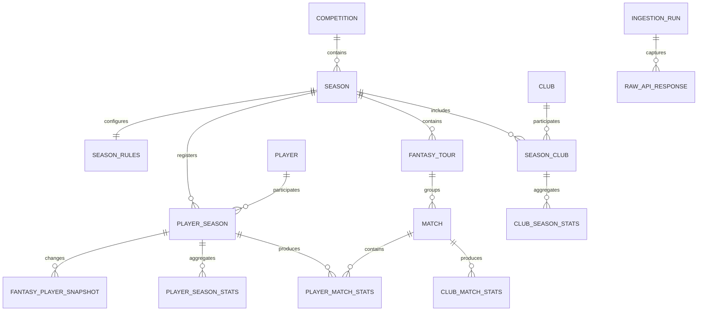

# Data model discovery

This document records facts observed against the live Sports.ru GraphQL API on
2026-07-19. The endpoint is internal and undocumented, so every assumption must
remain covered by a live contract check.

## Confirmed source objects

| Source object | Observed identifier | Storage grain |
| --- | --- | --- |
| Fantasy tournament | `1` / `russia` | Competition |
| Completed season | Fantasy `59`, stat `rfpl_25-26` | Season |
| Active season | Fantasy `75`, stat `rfpl_26-27` | Season |
| Fantasy team | Numeric string, for example `10` | Club within season |
| Stat team | Slug, for example `fc_krasnodar` | Cross-season club candidate |
| Fantasy player | Numeric string, for example `54138` | Player within season |
| Stat player | Slug, for example `eduard_spertsyan` | Cross-season player candidate |
| Fantasy tour | Numeric string | Tour within season |
| Stat match | Numeric string | Match |

Stat slugs are useful for joining seasons, but they are still external
identifiers rather than guaranteed immutable primary keys. Internal surrogate
keys are used throughout the proposed schema.

## Observed volume for 2025/2026

- 16 clubs
- 30 fantasy tours
- 240 matches
- 590 fantasy player records

The player count includes records without meaningful playing time and may
include players who left the tournament. Analytics training sets must filter by
minutes and availability rather than assuming every catalog entry is active.

## Entity relationships

## Why the grains are separate

### Player and player season

`FantasySeasonPlayer` combines identity, season registration and mutable
fantasy state. It is split into:

- `players`: candidate cross-season identity from `statObject.id`;
- `player_seasons`: fantasy ID, season and role;
- `fantasy_player_snapshots`: price, club, status, ownership and form;
- `player_season_stats`: aggregates captured by an ingestion run;
- `player_match_stats`: one row per player and match.

This supports transfers between clubs and prevents a refresh from overwriting
the values used by an earlier model run.

### Club and season club

Fantasy team IDs and stat team IDs use different namespaces. `clubs` stores the
stat identity candidate, while `season_clubs` stores the fantasy identity and
season-specific display name.

### Rules and constraints

The checked 2025/2026 season had:

- budget 100;
- roster 2 goalkeepers, 5 defenders, 5 midfielders and 3 forwards;
- 11 starting players;
- usually 3 transfers per tour;
- usually at most 3 players from one club;
- 6 transfers in tour 19.

These values demonstrably vary by tour. Optimizer constraints must come from
`season_rules` and `fantasy_tours`, never constants.

## Field mapping

| GraphQL path | Proposed table |
| --- | --- |
| `tournament` | `competitions` |
| `tournament.seasons` | `seasons` |
| `season.info.constraints` and `season.rules` | `season_rules` |
| `season.info.teams` | `clubs`, `season_clubs` |
| `season.tours` | `fantasy_tours` |
| `tour.matches` | `matches` |
| `players.list` | `players`, `player_seasons` |
| `player.price`, `status`, `seasonScoreInfo` | `fantasy_player_snapshots` |
| `player.gameStat` | `player_season_stats` |
| `player.matches.playerMatchInfo` | `player_match_stats` |
| `player.matches.statDetails` | `fantasy_point_details` |
| `stat_season.stats(id)` | `club_season_stats` |
| Derived match scores | `club_match_stats`, `club_season_stats` |

## Data quality findings

1. `statDetails` was empty in sampled completed matches. Exact point
   decomposition cannot depend on it until broader coverage is checked.
2. `statTeamSeasonStat.YellowCards` and `RedCards` returned zero for the tested
   club season. Those fields require reconciliation before use.
3. The fantasy aggregate has no explicit match count or clean-sheet field.
   Match count comes from player history; clean sheets must be derived.
4. Historical injury/status snapshots are not exposed by the tested queries.
   They can only be accumulated during future manual refreshes.
5. Fantasy and stat APIs are related through `statObject`, but their IDs belong
   to different namespaces.
6. Sports.ru freezes fantasy statistics 72 hours after the final match of a
   tour, so recently completed tours can still change.

## Questions left for the next discovery iteration

- Which `statMatch` fields reliably expose shots, possession, xG and lineups for
  every RPL match?
- Can player match histories be fetched efficiently in batches without one
  request per player?
- How frequently are player ownership and form updated?
- Are stat player and team slugs preserved after renames or transfers?
- Which event fields reproduce fantasy assists and ball recoveries?
- Are current-season suspensions and injuries complete enough for expected
  minutes modeling?

The prototype intentionally keeps raw responses so these questions can be
answered without losing the source payload that led to a schema decision.
