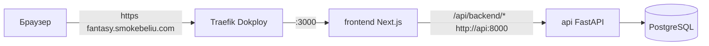

# Деплой Fantasy Analytics на Dokploy (OVH VPS)

Руководство по развёртыванию приложения на выделенном сервере через
[Dokploy](https://dokploy.com) с автоматическим деплоем при мердже в ветку
`develop`. Относится к операционному треку шага 13 плана разработки.

## Архитектура деплоя



- Публично доступен только `frontend` (Next.js) на `fantasy.smokebeliu.com`.
- Все запросы браузера идут same-origin через `/api/backend/*` и проксируются
  Next.js на `api` по внутренней сети — CORS и отдельный домен для API не нужны.
- `api` и `postgres` живут в приватной сети `fantasy-internal` и наружу не
  публикуются.
- TLS-сертификат выпускает Traefik (Let's Encrypt), встроенный в Dokploy.

Файлы деплоя в репозитории:

- `compose.prod.yaml` — прод-стек (postgres + migrate + api + frontend) с
  Traefik-метками для домена.
- `.env.prod.example` — список обязательных переменных окружения.
- `.github/workflows/ci-cd.yml` — CI (тесты backend + frontend) и триггер
  автодеплоя в Dokploy при пуше/мердже в `develop`.

## Шаг 1. DNS

Домен `smokebeliu.com` уже управляется у регистратора. Нужно добавить запись
для поддомена приложения (сам Dokploy уже отвечает на `deploy.smokebeliu.com` →
`145.239.74.111`):

| Тип  | Имя (host) | Значение                          | TTL   |
| ---- | ---------- | --------------------------------- | ----- |
| A    | `fantasy`  | `145.239.74.111`                  | 3600  |
| AAAA | `fantasy`  | `2001:41d0:305:2100::1:375f` (опц.) | 3600  |

Запись `A` обязательна. `AAAA` добавляйте только если хотите отвечать и по
IPv6 (у VPS он есть). Проверка распространения:

```bash
dig +short fantasy.smokebeliu.com     # должно вернуть 145.239.74.111
```

Пока DNS не резолвится, Let's Encrypt не сможет выпустить сертификат.

## Шаг 2. Приложение в Dokploy

В панели `https://deploy.smokebeliu.com`:

1. **Create → Compose** (тип «Docker Compose») внутри нужного проекта.
2. **Provider = GitHub**, выберите этот репозиторий и ветку **`develop`**.
   (Если GitHub ещё не подключён — Settings → Git → GitHub, установите Dokploy
   GitHub App на репозиторий.)
3. **Compose Path** = `compose.prod.yaml`.
4. **Environment** — вставьте переменные из `.env.prod.example`, обязательно
   задав надёжный `POSTGRES_PASSWORD`:

   ```env
   POSTGRES_DB=fantasy
   POSTGRES_USER=fantasy
   POSTGRES_PASSWORD=<надёжный-секрет>
   FRONTEND_DOMAIN=fantasy.smokebeliu.com
   ```

5. **Deploy**. Dokploy соберёт образы, поднимет `postgres`, выполнит миграции
   (сервис `migrate`), запустит `api` и `frontend`.

### Про домен и Traefik

Маршрутизация домена уже прописана метками Traefik в `compose.prod.yaml`
(роутер на `fantasy.smokebeliu.com`, порт 3000, `certresolver=letsencrypt`,
редирект http→https). Отдельно добавлять домен во вкладке «Domains» не
требуется. Если вы предпочитаете задавать домен через UI Dokploy — уберите
блок `labels` у сервиса `frontend` и укажите домен/порт (3000) в панели.

> Проверьте, что имя внешней сети совпадает с сетью Dokploy: по умолчанию это
> `dokploy-network`, а имя cert resolver — `letsencrypt`. Убедиться можно на
> сервере: `docker network ls | grep dokploy`.

## Шаг 3. Первичное наполнение данными

Миграции применяются автоматически при каждом деплое (сервис `migrate`).
Но read-эндпоинты и фронтенд показывают данные только после импорта сезона и
расчёта прогноза. Импорт ходит в живой Sports.ru GraphQL API (нужен исходящий
интернет с VPS).

Вариант A — через админ-эндпоинт API (внутри контейнера, наружу он не открыт):

```bash
# на VPS
docker compose -p fantasy-analytics exec api \
  python3 -c "import urllib.request,json; \
  print(urllib.request.urlopen(urllib.request.Request( \
  'http://localhost:8000/admin/ingestion/rpl/refresh', method='POST')).read())"
```

Вариант B — напрямую CLI внутри контейнера `api`:

```bash
docker compose -p fantasy-analytics exec api \
  fantasy-ingest --season-name 2025/2026
docker compose -p fantasy-analytics exec api \
  fantasy-forecast --tour <id-следующего-тура>
```

Полный импорт сезона занимает ~45 секунд. Без `fantasy-forecast` таблица
проекций пуста и фронтенд не покажет прогнозы. Кнопка обновления прямо из UI
появится в шаге 11 плана.

## Шаг 4. Автодеплой при мердже в `develop`

Реализовано через GitHub Actions (`.github/workflows/ci-cd.yml`): на PR и пуш в
`develop` прогоняются тесты backend и frontend; при пуше/мердже в `develop`,
если тесты зелёные, workflow дёргает деплой-вебхук Dokploy.

Настройка (один раз):

1. В Dokploy откройте приложение → вкладка **Deployments / Webhooks** и
   скопируйте **Deploy Webhook URL** (вид
   `https://deploy.smokebeliu.com/api/deploy/compose/<token>`).
2. В GitHub: **Settings → Secrets and variables → Actions → New repository
   secret**, имя `DOKPLOY_DEPLOY_WEBHOOK`, значение — скопированный URL.

После этого любой мёрж в `develop` (после прохождения CI) автоматически
пересобирает и перезапускает стек на сервере.

> Альтернатива без Actions: включить в Dokploy нативный **Auto Deploy** и
> добавить его webhook в Settings → Webhooks репозитория GitHub. Тогда Dokploy
> сам ловит push, но без гейта по тестам. Рекомендуемый вариант — через
> Actions, чтобы деплой шёл только на зелёных тестах.

## Шаг 5. Smoke-тест

```bash
curl -I https://fantasy.smokebeliu.com                 # 200, валидный TLS
curl -s https://fantasy.smokebeliu.com/api/backend/health   # {"status":"ok"}
```

Откройте `https://fantasy.smokebeliu.com` — страница тура должна отрисоваться;
после импорта и forecast появятся игроки и прогнозы.

## Обслуживание

- Логи: `docker compose -p fantasy-analytics logs -f api frontend` (или через
  UI Dokploy).
- Данные PostgreSQL сохраняются в volume `postgres_data` и переживают
  пересборку контейнеров.
- Бэкап БД:
  `docker compose -p fantasy-analytics exec postgres pg_dump -U fantasy fantasy > backup.sql`.
- В Dokploy можно настроить автоматические резервные копии тома/БД во вкладке
  Backups.

## Что ещё нужно от вас

1. **DNS** — создать `A`-запись `fantasy → 145.239.74.111` (шаг 1).
2. **GitHub App Dokploy** — установить на репозиторий (или подключить репозиторий
   в Dokploy иным способом) для сборки из `develop`.
3. **`POSTGRES_PASSWORD`** — придумать и внести в Environment приложения.
4. **`DOKPLOY_DEPLOY_WEBHOOK`** — скопировать из Dokploy и добавить секретом в
   GitHub Actions (шаг 4).
5. Подтвердить, что публикуется только `frontend`, а админ-эндпоинты API
   остаются внутренними (в первой версии у них нет авторизации).
