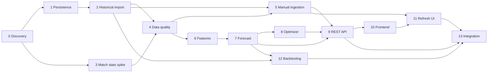

# План дальнейшей разработки Fantasy Analytics

Обновлено: 2026-07-19  
Текущий прогресс: 2 из 14 шагов завершён.

## Цель

Построить локально запускаемую систему, которая по данным Fantasy РПЛ и
футбольной статистике Sports.ru прогнозирует очки игроков и предлагает состав
на следующий тур.

План является рабочим документом. Агент, выполняющий шаг, обязан обновить этот
файл перед началом работы и после её завершения.

## Зафиксированные решения

- Backend и аналитика: Python.
- Основная БД: PostgreSQL.
- Frontend: TypeScript и Next.js.
- Sports.ru GraphQL вызывается только сборщиком данных.
- Исходные ответы GraphQL сохраняются до нормализации.
- Обновление данных в первой версии запускается вручную.
- Планировщик и регулярные фоновые обновления пока не нужны.
- Правила состава, лимиты клуба и трансферов берутся из API, а не из констант.
- Авторизация и хранение cookies Sports.ru не входят в первую версию.
- Каждый расчёт прогноза должен иметь версию модели и snapshot входных данных.

## Протокол работы независимого агента

Каждому агенту передаётся только репозиторий и номер одного шага из этого
документа. Контекст предыдущих разговоров не требуется.

Перед реализацией агент обязан:

1. Прочитать `README.md`, `docs/data-model.md` и этот файл.
2. Проверить, что все зависимости шага имеют статус `DONE`.
3. Изменить статус шага на `IN_PROGRESS` в сводной таблице и в его карточке.
4. Заполнить дату начала и идентификатор агента или ветки.
5. Не включать задачи из последующих шагов.

После реализации агент обязан:

1. Выполнить все критерии приёмки шага.
2. Записать команды проверок и их результат в карточку шага.
3. Обновить документацию, если изменились команды или архитектурные решения.
4. Установить статус `DONE` либо `BLOCKED`.
5. Для `DONE` указать дату, commit/PR и краткий фактический результат.
6. Для `BLOCKED` описать точную причину и необходимое действие.
7. Добавить строку в журнал изменений в конце этого файла.
8. Пересчитать общий прогресс и перевести доступные следующие шаги в `READY`.
9. Закоммитить обновление плана вместе с результатом шага.

Шаг нельзя помечать `DONE`, если его тесты не проходят. Если реализация
отличается от плана, отклонение и причина фиксируются в карточке.

Статусы:

- `PLANNED` — зависимости ещё не завершены.
- `READY` — шаг можно отдавать независимому агенту.
- `IN_PROGRESS` — шаг закреплён за агентом.
- `BLOCKED` — обнаружен внешний или технический блокер.
- `DONE` — критерии приёмки выполнены.

## Сводная таблица

| Шаг | Название | Зависимости | Статус |
| --- | --- | --- | --- |
| 0 | Discovery-прототип и локальный Docker | — | `DONE` |
| 1 | Persistence layer и миграции | 0 | `DONE` |
| 2 | Полный исторический импорт | 1 | `IN_PROGRESS` |
| 3 | Исследование расширенной match-статистики | 0 | `READY` |
| 4 | Контроль качества и reconciliation | 2, 3 | `PLANNED` |
| 5 | Ручной ingestion job и backend-команда | 2, 4 | `PLANNED` |
| 6 | Аналитические признаки | 4 | `PLANNED` |
| 7 | Базовая модель прогноза | 6 | `PLANNED` |
| 8 | Оптимизатор состава | 7 | `PLANNED` |
| 9 | Пользовательский REST API | 5, 7, 8 | `PLANNED` |
| 10 | Аналитический frontend | 9 | `PLANNED` |
| 11 | Ручное обновление из frontend | 5, 10 | `PLANNED` |
| 12 | Backtesting и сравнение моделей | 2, 7 | `PLANNED` |
| 13 | Интеграционная сборка и эксплуатационная готовность | 9, 11, 12 | `PLANNED` |

## Шаги

### Шаг 0. Discovery-прототип и локальный Docker

Статус: `DONE`

Задача: подтвердить доступность данных Sports.ru и сформировать первичную модель
данных.

Фактический результат:

- Работает CLI для live GraphQL discovery.
- Подтверждены 16 клубов, 30 туров, 240 матчей и 590 fantasy-записей игроков
  сезона 2025/2026.
- Добавлены `schema/postgres.sql`, Dockerfile и Compose с PostgreSQL 18.
- Зафиксированы ограничения API в `docs/data-model.md`.
- Проходят 13 unit-тестов.

Карточка выполнения:

- Начат: 2026-07-19
- Завершён: 2026-07-19
- Commit: `ac9be65`
- Проверки: unit-тесты, live discovery, статическая проверка Compose.
- Отклонения: Docker daemon отсутствовал в агентском окружении; полный Compose
  запуск должен быть подтверждён локально.

### Шаг 1. Persistence layer и миграции

Статус: `DONE`

Цель: заменить файловые артефакты полноценной записью нормализованных данных в
PostgreSQL.

Зависимости: шаг 0.

Детали:

- Выбрать и настроить SQLAlchemy 2 и Alembic.
- Преобразовать `schema/postgres.sql` в версионируемые миграции.
- Оставить один авторитетный способ изменения схемы, исключив расхождение DDL и
  миграций.
- Добавить конфигурацию `DATABASE_URL`, транзакции и repository layer.
- Реализовать persistence для `ingestion_runs` и `raw_api_responses`.
- Добавить интеграционные тесты с PostgreSQL из Compose.

Критерии приёмки:

- Новая БД создаётся с нуля одной командой.
- Миграции применяются и откатываются в тестовом окружении.
- Raw GraphQL payload и статус запуска сохраняются транзакционно.
- Повторная запись одного payload не создаёт дубликат.
- Unit- и integration-тесты проходят.

Не входит: полный импорт всех доменных таблиц.

Фактический результат:

- Модели SQLAlchemy 2 (`src/fantasy_analytics/db/models.py`) — единственный
  авторитетный источник схемы; файл `schema/postgres.sql` удалён.
- Настроен Alembic; начальная миграция `0001` материализует метаданные моделей
  (применяется и откатывается). Проверено `compare_metadata`: расхождений нет.
- Добавлены engine/session helpers, `session_scope` и конфигурация
  `DATABASE_URL` (`db/config.py`).
- `IngestionRepository` (`db/repository.py`) транзакционно управляет статусами
  `ingestion_runs` и идемпотентно пишет `raw_api_responses` (dedup по SHA-256
  хешу ответа и unique-констрейнту).
- Добавлены CLI `fantasy-migrate` и сервис `migrate` в Compose/Make; чистая БД
  создаётся одной командой `make migrate` (или `fantasy-migrate upgrade`).

Карточка выполнения:

- Начат: 2026-07-20
- Завершён: 2026-07-20
- Агент/ветка: `cursor/persistence-layer-migrations-bd72`
- Commit/PR: `0b9d2d2`
- Проверки:
  - `python -m fantasy_analytics.db.cli upgrade/downgrade` на PostgreSQL 16 —
    18 таблиц создаются и полностью удаляются.
  - `fantasy-migrate upgrade` на чистой БД создаёт схему одной командой.
  - `compare_metadata(models, db)` — 0 расхождений (DDL и модели совпадают).
  - `python -m unittest discover -s tests` — 24 теста проходят (с БД);
    без БД 9 интеграционных тестов корректно пропускаются.
  - `python -m build --wheel` — миграции и mako попадают в дистрибутив.
- Решения и отклонения:
  - Начальная миграция использует `metadata.create_all/drop_all` вместо
    статичных `op.create_table`, чтобы гарантировать единый источник схемы и
    исключить дрейф между ORM и DDL. Последующие миграции должны использовать
    `alembic revision --autogenerate`.
  - Драйвер — psycopg 3 (`postgresql+psycopg://`).
  - Docker daemon в окружении агента отсутствовал; интеграция проверена на
    локально установленном PostgreSQL 16, полный запуск Compose должен быть
    подтверждён локально (аналогично шагу 0).

### Шаг 2. Полный исторический импорт

Статус: `IN_PROGRESS`

Цель: загрузить прошлый сезон в PostgreSQL на уровне сезона, тура, матча, клуба
и каждого игрока.

Зависимости: шаг 1.

Детали:

- Сохранять турнир, сезон, правила, клубы, туры и матчи.
- Загружать все страницы игроков, snapshots и сезонные агрегаты.
- Загружать match history всех игроков с игровыми минутами.
- Делать idempotent upsert по внешним идентификаторам.
- Добавить retry, backoff, ограничение параллелизма и понятный progress output.
- Поддержать `--season-id`, `--season-name` и последний завершённый сезон.

Критерии приёмки:

- Для 2025/2026 сохранены 16 клубов, 30 туров и 240 матчей.
- Сохранены все 590 fantasy-записей и match history игроков с минутами.
- Повторный запуск не меняет количество логических сущностей.
- Ошибка одной страницы не публикует частично успешный snapshot.
- Итоговый отчёт содержит количество записей и длительность каждой стадии.

Не входит: расширенная статистика `statMatch`.

Карточка выполнения:

- Начат: 2026-07-21
- Завершён:
- Агент/ветка: `cursor/full-historical-import-d9c2`
- Commit/PR:
- Проверки:
- Решения и отклонения:

### Шаг 3. Исследование расширенной match-статистики

Статус: `READY`

Цель: определить, какие футбольные показатели Sports.ru стабильно отдаёт для
матчей РПЛ.

Зависимости: шаг 0.

Детали:

- Исследовать `statMatch`, составы, события и player match stats.
- Проверить удары, xG, владение, сейвы, стандарты, карточки и минуты.
- Взять выборку минимум из 30 матчей разных клубов и частей сезона.
- Для каждого поля измерить заполненность и согласованность.
- Сохранить raw fixtures и отчёт field coverage.
- Предложить минимальные изменения модели данных, но не строить прогноз.

Критерии приёмки:

- Есть таблица `GraphQL path → тип → заполненность → решение`.
- Запросы воспроизводимы отдельной CLI-командой.
- Ненадёжные и отсутствующие поля явно исключены.
- Документированы идентификаторы для связи Fantasy и stat API.
- Добавлены контрактные тесты для выбранных операций.

Не входит: массовая загрузка и ML.

Карточка выполнения:

- Начат:
- Завершён:
- Агент/ветка:
- Commit/PR:
- Проверки:
- Решения и отклонения:

### Шаг 4. Контроль качества и reconciliation

Статус: `PLANNED`

Цель: автоматически обнаруживать неполные или противоречивые данные до
аналитических расчётов.

Зависимости: шаги 2 и 3.

Детали:

- Проверять количество туров, матчей, клубов и игроков.
- Сверять результаты матчей с клубными сезонными агрегатами.
- Сверять сумму player-match очков с сезонными fantasy-очками.
- Проверять минуты, роли, внешние ID и обязательные связи.
- Учитывать 72-часовое окно корректировки статистики Sports.ru.
- Сохранять нарушения в `data_quality_issues`.

Критерии приёмки:

- Есть формализованный набор blocking и warning проверок.
- Некорректный snapshot не становится активным.
- Отчёт показывает ожидаемое и фактическое значение каждой проверки.
- Fixtures покрывают пропущенную страницу, дубль ID и изменение результата.

Не входит: исправление данных вручную через UI.

Карточка выполнения:

- Начат:
- Завершён:
- Агент/ветка:
- Commit/PR:
- Проверки:
- Решения и отклонения:

### Шаг 5. Ручной ingestion job и backend-команда

Статус: `PLANNED`

Цель: запускать полное обновление по запросу, без scheduler.

Зависимости: шаги 2 и 4.

Детали:

- Добавить FastAPI-приложение.
- Реализовать `POST /admin/ingestion/rpl/refresh`.
- Реализовать `GET /admin/ingestion/runs/{id}`.
- Выполнять импорт отдельным worker-процессом.
- Использовать PostgreSQL job table и advisory lock вместо Redis.
- Публиковать snapshot только после успешного импорта и проверок.

Критерии приёмки:

- API сразу возвращает `202` и ID задания.
- Одновременно выполняется не более одного refresh турнира.
- Статусы `pending/running/succeeded/failed` сохраняются после перезапуска API.
- Ошибка содержит безопасное диагностическое сообщение.
- Успешный запуск обновляет время актуальности данных.

Не входит: кнопка во frontend и автоматический запуск.

Карточка выполнения:

- Начат:
- Завершён:
- Агент/ветка:
- Commit/PR:
- Проверки:
- Решения и отклонения:

### Шаг 6. Аналитические признаки

Статус: `PLANNED`

Цель: построить воспроизводимый dataset для прогноза следующего тура.

Зависимости: шаг 4.

Детали:

- Рассчитать rolling-метрики игроков за 3, 5 и 10 матчей.
- Рассчитать per-90 показатели и долю матчей в стартовом составе.
- Рассчитать домашнюю и гостевую силу атаки/защиты клубов.
- Добавить силу соперника, отдых и статус доступности.
- Отдельно оценивать вероятность выхода и ожидаемые минуты.
- Исключить leakage: признаки используют только данные до дедлайна тура.

Критерии приёмки:

- Dataset строится одной командой для указанного тура.
- Каждая строка имеет `player`, `tour`, cutoff time и версию признаков.
- Unit-тесты подтверждают rolling windows и отсутствие будущих матчей.
- Пропуски имеют явную стратегию заполнения.
- Словарь признаков документирован.

Не входит: выбор финального ML-алгоритма.

Карточка выполнения:

- Начат:
- Завершён:
- Агент/ветка:
- Commit/PR:
- Проверки:
- Решения и отклонения:

### Шаг 7. Базовая модель прогноза

Статус: `PLANNED`

Цель: получить ожидаемые fantasy-очки каждого доступного игрока следующего
тура.

Зависимости: шаг 6.

Детали:

- Построить интерпретируемый baseline, начиная с ожидаемых минут.
- Оценить голы команд Poisson-моделью.
- Оценить вклад голов, ассистов, сухих матчей, сейвов и возвратов.
- Конвертировать события в очки по правилам выбранного сезона.
- Сохранять expected points, uncertainty и компоненты прогноза.
- Версионировать модель, параметры и snapshot данных.

Критерии приёмки:

- Прогноз строится для всех доступных игроков тура.
- Сумма компонентов объясняет итоговый expected points.
- Повторный расчёт на одинаковом snapshot детерминирован.
- Есть простые baselines: средние очки и последние N матчей.
- Результаты сохраняются в БД с версией модели.

Не входит: нейросети и автоматический подбор гиперпараметров.

Карточка выполнения:

- Начат:
- Завершён:
- Агент/ветка:
- Commit/PR:
- Проверки:
- Решения и отклонения:

### Шаг 8. Оптимизатор состава

Статус: `PLANNED`

Цель: выбрать валидные 15 игроков, стартовый состав, капитана и скамейку.

Зависимости: шаг 7.

Детали:

- Использовать OR-Tools CP-SAT или эквивалентный целочисленный solver.
- Получать бюджет и позиционные лимиты из `season_rules`.
- Получать club limit и трансферы из конкретного тура.
- Поддержать стартовые схемы, капитана, вице-капитана и порядок скамейки.
- Добавить режим нового состава и режим ограниченных трансферов.
- Возвращать объяснение выбора и неиспользованный бюджет.

Критерии приёмки:

- Каждый результат проходит отдельный validator правил.
- Есть fixtures для обычного тура и тура с изменённым лимитом трансферов.
- Solver сообщает понятную ошибку для неразрешимой задачи.
- Objective соответствует сумме ожидаемых очков с учётом капитана.
- Результат детерминирован при одинаковых входах.

Не входит: автоматическая отправка состава на Sports.ru.

Карточка выполнения:

- Начат:
- Завершён:
- Агент/ветка:
- Commit/PR:
- Проверки:
- Решения и отклонения:

### Шаг 9. Пользовательский REST API

Статус: `PLANNED`

Цель: предоставить frontend стабильный read API для аналитики и оптимизации.

Зависимости: шаги 5, 7 и 8.

Детали:

- Добавить endpoints сезонов, туров, матчей и игроков.
- Добавить фильтры по позиции, клубу, цене и статусу.
- Добавить выдачу projections и объясняющих компонентов.
- Добавить `POST /optimizer/squad` и `POST /optimizer/transfers`.
- Ввести Pydantic-контракты, пагинацию и единый формат ошибок.
- Сгенерировать и зафиксировать OpenAPI schema.

Критерии приёмки:

- API покрыт unit- и integration-тестами.
- OpenAPI отражает реальные request/response модели.
- Пагинация стабильна и имеет верхний лимит.
- В ответах есть время snapshot и версия модели.
- GraphQL Sports.ru никогда не вызывается из read endpoints.

Не входит: публичная регистрация пользователей.

Карточка выполнения:

- Начат:
- Завершён:
- Агент/ветка:
- Commit/PR:
- Проверки:
- Решения и отклонения:

### Шаг 10. Аналитический frontend

Статус: `PLANNED`

Цель: показать данные следующего тура и позволить собрать состав.

Зависимости: шаг 9.

Детали:

- Создать Next.js-приложение с TypeScript.
- Добавить страницу тура и таблицу игроков.
- Реализовать фильтры, сортировку и сравнение игроков.
- Добавить карточку игрока с историей и объяснением прогноза.
- Добавить конструктор состава и вызов оптимизатора.
- Показывать свежесть данных и версию модели.

Критерии приёмки:

- Интерфейс работает на desktop и mobile.
- Все ограничения состава валидируются до отправки.
- Состояния loading, empty и error покрыты.
- Основные сценарии имеют component/e2e тесты.
- Frontend запускается через локальный Compose.

Не входит: ручное обновление данных и авторизация.

Карточка выполнения:

- Начат:
- Завершён:
- Агент/ветка:
- Commit/PR:
- Проверки:
- Решения и отклонения:

### Шаг 11. Ручное обновление из frontend

Статус: `PLANNED`

Цель: дать пользователю безопасную кнопку обновления перед туром.

Зависимости: шаги 5 и 10.

Детали:

- Добавить административный экран обновления.
- Показывать этап, прогресс и время запуска job.
- Polling использовать только пока job не завершён.
- Блокировать повторный запуск при активном задании.
- После успеха обновлять данные и показывать новый snapshot.
- После ошибки показывать безопасное сообщение и возможность повтора.

Критерии приёмки:

- Кнопка запускает реальный ingestion job.
- Перезагрузка страницы не теряет состояние задания.
- Повторный клик не создаёт параллельный импорт.
- UI показывает последний успешный snapshot и целевой тур.
- Сценарии success/failure покрыты e2e тестом.

Не входит: scheduler и уведомления.

Карточка выполнения:

- Начат:
- Завершён:
- Агент/ветка:
- Commit/PR:
- Проверки:
- Решения и отклонения:

### Шаг 12. Backtesting и сравнение моделей

Статус: `PLANNED`

Цель: проверить, улучшает ли прогноз выбор состава на исторических турах.

Зависимости: шаги 2 и 7.

Детали:

- Последовательно симулировать туры без доступа к будущим данным.
- Сравнить модель со средними очками, формой и value baseline.
- Измерять MAE/RMSE прогноза и очки оптимального состава.
- Отдельно оценивать позиции, стартовый состав и капитана.
- Сохранять параметры запуска и результаты.
- Добавить отчёт с ошибками и наиболее нестабильными признаками.

Критерии приёмки:

- Cutoff каждого тура проверяется автоматически.
- Результат воспроизводим одной командой.
- Есть сравнение минимум с двумя простыми baseline.
- Метрики представлены по турам и позициям.
- Вывод содержит решение: принять модель, изменить или оставить baseline.

Не входит: live A/B-тест.

Карточка выполнения:

- Начат:
- Завершён:
- Агент/ветка:
- Commit/PR:
- Проверки:
- Решения и отклонения:

### Шаг 13. Интеграционная сборка и эксплуатационная готовность

Статус: `PLANNED`

Цель: запускать полную первую версию локально и на одном сервере.

Зависимости: шаги 9, 11 и 12.

Детали:

- Расширить Compose сервисами API, worker, frontend и PostgreSQL.
- Добавить healthchecks, dependency ordering и graceful shutdown.
- Добавить CI для lint, unit, integration и frontend tests.
- Добавить миграции при развёртывании и проверку совместимости схемы.
- Документировать backup/restore и безопасные локальные secrets.
- Добавить structured logs и endpoint состояния компонентов.

Критерии приёмки:

- Чистый checkout запускается документированной командой.
- Пользователь может обновить данные и получить состав через UI.
- Перезапуск контейнеров не теряет БД и job status.
- CI проходит на чистом окружении.
- README содержит полный smoke-test первой версии.

Не входит: Kubernetes, autoscaling и многопользовательская SaaS-эксплуатация.

Карточка выполнения:

- Начат:
- Завершён:
- Агент/ветка:
- Commit/PR:
- Проверки:
- Решения и отклонения:

## Журнал обновлений

| Дата | Шаг | Изменение статуса | Commit/PR | Результат |
| --- | --- | --- | --- | --- |
| 2026-07-19 | 0 | `IN_PROGRESS → DONE` | `ac9be65` | Подтверждён API, добавлены прототип, DDL и Docker |
| 2026-07-19 | План | создан | — | Сформированы независимые шаги 1–13 |
| 2026-07-20 | 1 | `READY → IN_PROGRESS` | — | Закреплён за `cursor/persistence-layer-migrations-bd72` |
| 2026-07-20 | 1 | `IN_PROGRESS → DONE` | `0b9d2d2` | SQLAlchemy 2, Alembic-миграции, repository для ingestion_runs/raw_api_responses |
| 2026-07-20 | 2 | `PLANNED → READY` | — | Разблокирован завершением шага 1 |
| 2026-07-21 | 2 | `READY → IN_PROGRESS` | — | Закреплён за `cursor/full-historical-import-d9c2` |
