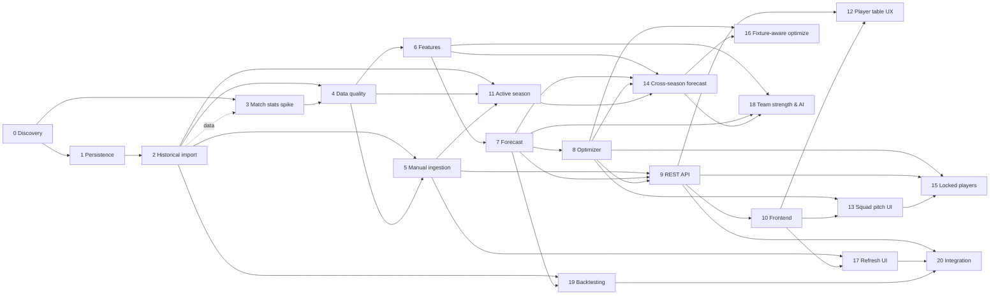

# План дальнейшей разработки Fantasy Analytics

Обновлено: 2026-08-09  
Текущий прогресс: 14 из 21 шагов завершён.

## Цель

Построить локально запускаемую систему, которая по данным Fantasy РПЛ и
футбольной статистике Sports.ru прогнозирует очки игроков и предлагает состав
на следующий тур.

План — рабочий документ: планирование, статусы и детали незавершённых шагов. Для
завершённых шагов приведены только цель и зависимости; их ключевые решения,
нюансы и полные карточки выполнения (даты, ветки, commit/PR, проверки) —
в [`docs/development-history.md`](development-history.md).

## Зафиксированные решения

- Backend и аналитика: Python.
- Основная БД: PostgreSQL.
- Frontend: TypeScript и Next.js.
- Sports.ru GraphQL вызывается только сборщиком данных.
- Исходные ответы GraphQL сохраняются до нормализации.
- Обновление данных в первой версии запускается вручную.
- Планировщик и регулярные фоновые обновления пока не нужны.
- Правила состава, лимиты клуба и трансферов берутся из API, а не из констант.
- Авторизация и хранение cookies Sports.ru не входят в первую версию.
- Каждый расчёт прогноза должен иметь версию модели и snapshot входных данных.
- Деплой первой версии — на выделенный OVH VPS под управлением Dokploy
  (Docker Compose + Traefik), приложение на `fantasy.smokebeliu.com`.
- Автодеплой выполняется при мердже в ветку `develop` (CI-гейт на тестах,
  затем деплой-вебхук Dokploy).
- Приложение работает с несколькими сезонами: завершённый 2025/2026 (fantasy
  `59`, stat `rfpl_25-26`) — исторический источник, активный 2026/2027 (fantasy
  `75`, stat `rfpl_26-27`) — целевой турнир. Данные за прошлый и текущий сезон
  визуально и в API разделяются, источник каждого числа помечается.
- Прогноз на первый тур нового сезона строится по данным прошлого сезона через
  кросс-сезонную идентичность (`players.stat_player_id`, `clubs.stat_team_id`);
  ушедшие игроки исключаются, новички получают прайоры без истории.
- Сила команд выводится из положения в таблице и результатов (доступно в
  Sports.ru через `stat_season.stats`); букмекерских котировок в API Sports.ru
  на данный момент нет — их доступность выясняется отдельной discovery-задачей.
- Опциональные AI-коэффициенты матчей/команд версионируются и хранятся
  снапшотом, чтобы прогноз и подбор состава оставались воспроизводимыми.

## Протокол работы независимого агента

Каждому агенту передаётся только репозиторий и номер одного шага из этого
документа. Контекст предыдущих разговоров не требуется.

Перед реализацией агент обязан:

1. Прочитать `README.md`, `docs/data-model.md` и этот файл.
2. Проверить, что все зависимости шага имеют статус `DONE`.
3. Изменить статус шага на `IN_PROGRESS` в сводной таблице и в карточке шага.
4. Завести карточку выполнения в `docs/development-history.md` и заполнить дату
   начала и идентификатор агента или ветки.
5. Не включать задачи из последующих шагов.

### Пререквизит данных: пустая БД при старте агента

База PostgreSQL в облачном окружении **пуста при каждом старте нового
клауд-агента** (данные из snapshot не сохраняются между запусками). Поэтому
любой шаг, которому нужны доменные данные (матчи, игроки, статистика), обязан
сначала выполнить импорт из шага 2 — это неявная предпосылка всех шагов,
зависящих от содержимого БД:

```bash
PYTHONPATH=src python3 -m fantasy_analytics.db.cli upgrade      # схема
PYTHONPATH=src python3 -m fantasy_analytics.ingest_cli --season-name 2025/2026
```

Проверить наполненность можно так:
`PGPASSWORD=fantasy psql -h localhost -U fantasy -d fantasy -c "SELECT count(*) FROM matches;"`.
Если результат `0`, импорт нужно запустить заново перед началом работы.

После реализации агент обязан:

1. Выполнить все критерии приёмки шага.
2. Записать команды проверок и их результат в карточку шага
   (`docs/development-history.md`).
3. Обновить документацию, если изменились команды или архитектурные решения.
4. Установить статус `DONE` либо `BLOCKED`; ключевые решения и нюансы шага
   зафиксировать в карточке истории (`docs/development-history.md`), а не в этом
   файле. Завершённый шаг в плане сжать до цели и зависимостей.
5. Для `DONE` указать в карточке дату, commit/PR и краткий фактический результат.
6. Для `BLOCKED` описать точную причину и необходимое действие.
7. Добавить строку в журнал изменений в `docs/development-history.md`.
8. Пересчитать общий прогресс и перевести доступные следующие шаги в `READY`.
9. Закоммитить обновление плана и истории вместе с результатом шага.

Шаг нельзя помечать `DONE`, если его тесты не проходят. Если реализация
отличается от плана, отклонение и причина фиксируются в карточке истории.

Статусы:

- `PLANNED` — зависимости ещё не завершены.
- `READY` — шаг можно отдавать независимому агенту.
- `IN_PROGRESS` — шаг закреплён за агентом.
- `BLOCKED` — обнаружен внешний или технический блокер.
- `DONE` — критерии приёмки выполнены.

## Сводная таблица

Незавершённые шаги (14–20) занумерованы по порядку приоритета: чем меньше номер,
тем важнее делать (см. раздел
[«Приоритизация оставшихся шагов»](#приоритизация-оставшихся-шагов)). Колонка
«Приоритет» показывает тир: `P0` — фундамент, `P1` — ядро ценности, `P2` —
усиление подбора, `P3` — продвинутая аналитика и эксплуатация. Приоритет
ортогонален статусу: он говорит «что важнее делать», статус — «можно ли уже
брать в работу».

| Шаг | Название | Зависимости | Приоритет | Статус |
| --- | --- | --- | --- | --- |
| 0 | Discovery-прототип и локальный Docker | — | — | `DONE` |
| 1 | Persistence layer и миграции | 0 | — | `DONE` |
| 2 | Полный исторический импорт | 1 | — | `DONE` |
| 3 | Исследование расширенной match-статистики | 0, 2 (данные) | — | `DONE` |
| 4 | Контроль качества и reconciliation | 2, 3 | — | `DONE` |
| 5 | Ручной ingestion job и backend-команда | 2, 4 | — | `DONE` |
| 6 | Аналитические признаки | 4 | — | `DONE` |
| 7 | Базовая модель прогноза | 6 | — | `DONE` |
| 8 | Оптимизатор состава | 7 | — | `DONE` |
| 9 | Пользовательский REST API | 5, 7, 8 | — | `DONE` |
| 10 | Аналитический frontend | 9 | — | `DONE` |
| 11 | Импорт активного сезона 2026/2027 и разделение сезонов | 2, 4, 5 | `P0` | `DONE` |
| 12 | Полная статистика в таблице игроков (сортировка по очкам, без фильтра по турам) | 9, 10 | `P1` | `DONE` |
| 13 | Раздел «Состав»: поле-схема, переключение вида, group-button фильтр | 8, 10 | `P1` | `DONE` |
| 14 | Кросс-сезонный прогноз состава на первый тур | 6, 7, 8, 11 | `P1` | `IN_PROGRESS` |
| 15 | Фиксация игроков и подбор оптимального состава под схему | 8, 9, 13 | `P2` | `READY` |
| 16 | Учёт соперников следующего тура в оптимизации | 8, 14 | `P2` | `PLANNED` |
| 17 | Ручное обновление из frontend | 5, 10 | `P2` | `READY` |
| 18 | Сила команд и AI-коэффициенты | 6, 7, 14 | `P3` | `PLANNED` |
| 19 | Backtesting и сравнение моделей | 2, 7 | `P3` | `PLANNED` |
| 20 | Интеграционная сборка и эксплуатационная готовность | 9, 17, 19 | `P3` | `PLANNED` |



## Приоритизация оставшихся шагов

Приоритеты расставлены «по смыслу» относительно главной цели — собрать состав на
новый турнир РПЛ 2026/2027 по данным прошлого сезона (вклад в цель, зависимости,
риск). Фундамент (шаг 11, `P0`) и быстрые UX-улучшения (шаги 12–13, `P1`) уже
завершены.

### P1 — ядро ценности

- **Шаг 14 (кросс-сезонный прогноз).** Прямо реализует основную задачу — состав
  на 1-й тур из прошлогодних данных с учётом ушедших и новых игроков. `READY`.

### P2 — усиление подбора состава

- **Шаг 15 (фиксация игроков).** Явно запрошенная функция, повышает практическую
  пользу подбора. `READY`.
- **Шаг 16 (учёт соперников).** Улучшает оптимизацию на очных встречах; зависит
  от кросс-сезонного прогноза (14).
- **Шаг 17 (ручное обновление из frontend).** Операционное удобство; не блокирует
  цель (обновление доступно через админ-API/CLI). `READY`.

### P3 — продвинутая аналитика и эксплуатация

- **Шаг 18 (сила команд и AI-коэффициенты).** Наибольшая сложность (discovery по
  котировкам, опциональный AI-слой); прирост качества поверх работающего подбора.
- **Шаг 19 (backtesting).** Внутренняя валидация модели; ценен для доверия к
  прогнозу, но не блокирует сбор состава.
- **Шаг 20 (интеграционная готовность).** Деплой уже работает; остаётся операционка
  (graceful shutdown, structured logs, smoke-test). Зависит от 17 и 19.

### Рекомендованный порядок

Оставшиеся: `14 → 15 → 16 → 17 → 18 → 19 → 20` (нумерация совпадает с приоритетом).

## Шаги

Завершённые шаги (0–13) даны сводкой «цель + зависимости»; их детали и карточки
выполнения — в [`docs/development-history.md`](development-history.md).
Незавершённые (14–20) описаны полностью (детали, критерии приёмки, границы).

### Завершённые (`DONE`)

- **Шаг 0. Discovery-прототип и локальный Docker** — зависимости: —. Подтвердить
  доступность данных Sports.ru и сформировать первичную модель данных.
- **Шаг 1. Persistence layer и миграции** — зависимости: 0. Заменить файловые
  артефакты записью нормализованных данных в PostgreSQL (SQLAlchemy 2 + Alembic).
- **Шаг 2. Полный исторический импорт** — зависимости: 1. Загрузить прошлый сезон
  в PostgreSQL на уровне сезона, тура, матча, клуба и каждого игрока.
- **Шаг 3. Исследование расширенной match-статистики** — зависимости: 0 (данные:
  импорт шага 2). Определить, какие показатели Sports.ru стабильно отдаёт по матчам.
- **Шаг 4. Контроль качества и reconciliation** — зависимости: 2, 3. Автоматически
  обнаруживать неполные/противоречивые данные до аналитики; публиковать снапшот.
- **Шаг 5. Ручной ingestion job и backend-команда** — зависимости: 2, 4. Запускать
  полное обновление по запросу (FastAPI + worker), без scheduler.
- **Шаг 6. Аналитические признаки** — зависимости: 4. Построить воспроизводимый
  leakage-free dataset для прогноза следующего тура.
- **Шаг 7. Базовая модель прогноза** — зависимости: 6. Получить ожидаемые
  fantasy-очки каждого доступного игрока следующего тура (+ baseline).
- **Шаг 8. Оптимизатор состава** — зависимости: 7. Выбрать валидные 15 игроков,
  стартовый состав, капитана и скамейку (OR-Tools CP-SAT).
- **Шаг 9. Пользовательский REST API** — зависимости: 5, 7, 8. Дать frontend
  стабильный read API для аналитики и оптимизации (только из БД).
- **Шаг 10. Аналитический frontend** — зависимости: 9. Показать данные следующего
  тура и позволить собрать состав (Next.js + TypeScript).
- **Шаг 11. Импорт активного сезона 2026/2027 и разделение сезонов** —
  зависимости: 2, 4, 5. Завести активный сезон рядом с завершённым 2025/2026 и
  явно различать исторические и текущие данные (запрос 1).
- **Шаг 12. Полная статистика в таблице игроков** — зависимости: 9, 10. Показать
  полную сезонную статистику, починить сортировку по очкам, убрать фильтр по
  турам (запросы 3 и 4).
- **Шаг 13. Раздел «Состав»: поле-схема, переключение вида, group-button фильтр** —
  зависимости: 8, 10. Схема состава на поле + список всех игроков, переключение
  вида, фильтр по позиции группой кнопок (запросы 5 и 6).

### Незавершённые (`READY` / `PLANNED`)

### Шаг 14. Кросс-сезонный прогноз состава на первый тур

Статус: `IN_PROGRESS`

Цель: собрать состав на 1-й тур нового турнира, отталкиваясь от статистики
прошлого сезона, при этом учитывая, что часть игроков отсутствует, а часть —
новые (запрос 2), и визуально разделяя данные прошлого и текущего сезона
(запрос 1).

Зависимости: шаги 6, 7, 8 и 11.

Детали:

- Пока в активном сезоне нет сыгранных матчей, признаки (`features.py`) и прогноз
  (`forecast.py`) для игрока берутся из прошлого сезона по кросс-сезонной
  идентичности (`stat_player_id`), а сила/венью — из клуба активного сезона
  (`stat_team_id`) и его расписания туров.
- Ушедшие/не заявленные в активном сезоне игроки исключаются из пула кандидатов
  (нет `player_season` в новом сезоне).
- Новички (нет истории в прошлом сезоне) получают документированные прайоры по
  позиции/цене/клубу и явный флаг `has_history=false`, чтобы не занулять их
  молча; отдельно продумать перешедших между клубами игроков.
- В прогнозе/фиче помечать источник статистики: `prior_season` vs
  `current_season`, чтобы фронт (шаги 12–13) визуально отделял историческую
  статистику от собираемой в этом сезоне.
- По мере появления матчей нового сезона прогноз плавно переходит на текущие
  данные (blend или переключение источника по объёму истории).

Критерии приёмки:

- `fantasy-forecast` строит прогноз на тур 1 активного сезона из данных прошлого
  сезона.
- Ушедшие игроки отсутствуют в кандидатах, новички присутствуют с прайорами и
  флагом отсутствия истории.
- В каждой строке прогноза указан источник статистики (прошлый/текущий сезон).
- Оптимизатор собирает валидный состав на первый тур нового турнира.

Не входит: учёт соперников и силы команд (шаги 16 и 18).

### Шаг 15. Фиксация игроков и подбор оптимального состава под схему

Статус: `READY`

Цель: дать возможность зафиксировать отдельных игроков, которых пользователь
точно хочет видеть в составе, и подобрать оптимальных остальных под его схему на
основе статистики (запрос 7).

Зависимости: шаги 8, 9 и 13.

Детали:

- В `optimizer.py` добавить `locked_ids` — принудительно включаемых игроков
  (`pick[i] == 1`, опционально `start[i] == 1` для фиксации именно в старте) с
  сохранением всех прочих ограничений (бюджет, роли, клубный лимит).
- Валидировать совместимость фиксаций с лимитами и бюджетом; при неразрешимости —
  понятный `OptimizerError` с указанием конфликтующего ограничения.
- Расширить `POST /optimizer/squad` (и при необходимости `/optimizer/transfers`)
  параметром `locked` и покрыть контрактом (`api_schemas.py`, OpenAPI).
- UI (раздел «Состав»): «пин» игрока на схеме/в списке и кнопка «подобрать
  оптимальных под мою схему», которая вызывает оптимизатор с зафиксированными
  игроками и заданной схемой/формацией.

Критерии приёмки:

- Зафиксированные игроки всегда присутствуют в решении оптимизатора.
- Остальные позиции заполняются оптимально в рамках правил.
- Несовместимый набор фиксаций возвращает понятную ошибку.
- Сценарий фиксации покрыт unit-тестом оптимизатора и e2e-тестом UI.

Не входит: учёт соперников и силы команд (шаги 16 и 18).

### Шаг 16. Учёт соперников следующего тура в оптимизации

Статус: `PLANNED`

Цель: учитывать при подборе состава, какая команда с кем встречается в следующем
туре, чтобы максимизировать очки и не брать конфликтующие ставки (запрос 8).

Зависимости: шаги 8 и 14.

Детали:

- Использовать календарь тура (пары матчей) в целевой функции оптимизатора: нет
  смысла одновременно брать вратаря/защиту одной команды и нападение другой, если
  они играют друг с другом — «сухарь» обороны и голы атаки соперника
  антикоррелированы.
- Смоделировать корреляцию исходов очной встречи: например, штраф за
  одновременный расчёт на clean sheet обороны команды A и на голы атаки команды
  B, когда в туре есть матч A vs B; либо совместное распределение голов пары
  вместо независимых ожиданий.
- Опираться на уже доступные в фиче поля соперника (`opponent_club_id`,
  `opponent_name`, `match_id`, `is_home`) и расписание тура из `matches`.
- Сохранить детерминизм и независимую валидацию решения.

Критерии приёмки:

- В очной встрече оптимизатор не берёт одновременно оборону одной стороны и атаку
  другой без чистой выгоды по ожидаемым очкам.
- Поведение подтверждено тестом на сконструированном примере пары команд.
- Эффект учёта календаря объясним в отчёте оптимизатора.

Не входит: коэффициенты силы команд и AI (шаг 18).

### Шаг 17. Ручное обновление из frontend

Статус: `READY`

Цель: дать пользователю безопасную кнопку обновления перед туром.

Зависимости: шаги 5 и 10.

Детали:

- Добавить административный экран обновления.
- Показывать этап, прогресс и время запуска job.
- Polling использовать только пока job не завершён.
- Блокировать повторный запуск при активном задании.
- После успеха обновлять данные и показывать новый snapshot.
- После ошибки показывать безопасное сообщение и возможность повтора.

Критерии приёмки:

- Кнопка запускает реальный ingestion job.
- Перезагрузка страницы не теряет состояние задания.
- Повторный клик не создаёт параллельный импорт.
- UI показывает последний успешный snapshot и целевой тур.
- Сценарии success/failure покрыты e2e тестом.

Не входит: scheduler и уведомления.

### Шаг 18. Сила команд и AI-коэффициенты

Статус: `PLANNED`

Цель: учитывать силу команд при оптимизации (сильнее команда — больше смысла
брать её атаку), проработать источники данных и, при необходимости, интеграцию с
AI для анализа предстоящих матчей (запрос 9).

Зависимости: шаги 6, 7 и 14.

Детали:

- **Что уже доступно в Sports.ru.** Командная таблица и результаты отдаются через
  `stat_season.stats(id, source: SPORTS_HUB)` (см. `queries.build_team_stats_query`:
  `MatchesPlayed/Won/Drawn/Lost`, `GoalsScored/Conceded`, `GroupPosition`,
  `CupRank`) и частично уже моделируются таблицей `club_season_stats`. Из этого
  можно вычислить положение в таблице, разницу мячей и форму → коэффициент силы
  команды. Это первоочередной, «бесплатный» источник.
- **Чего нет.** Букмекерских котировок в текущих GraphQL-запросах Sports.ru нет —
  поле не обнаружено. Нужна отдельная discovery-под-задача: проверить схему
  Sports.ru на наличие odds/котировок; если их нет — зафиксировать вывод и
  рассмотреть внешний источник котировок или оценку силы без них.
- **AI-интеграция (опционально).** Сервис, анализирующий предстоящие матчи
  (положение в таблице, форма, домашнее поле, при наличии — котировки) и
  выдающий доп-коэффициенты командам/матчам. Коэффициенты подмешиваются в силу
  атаки/защиты в `features.py`/`forecast.py`; их источник и версия хранятся
  снапшотом, чтобы прогноз оставался воспроизводимым (см. «Зафиксированные
  решения»).
- **Влияние на состав.** Сильная команда против слабой обороны → апсайд её
  атакующих; крепкая оборона против слабой атаки → апсайд «сухаря». Эти сигналы
  должны согласованно менять ожидаемые очки, а не хардкодиться в оптимизаторе.

Критерии приёмки:

- Коэффициент силы команды вычисляется из доступных данных (таблица/результаты) и
  версионируется.
- В плане/доке зафиксирован вывод о доступности букмекерских котировок в
  Sports.ru.
- Если добавляется AI-слой — его коэффициенты версионируются и воспроизводимы,
  прогноз на одном снапшоте детерминирован.
- Прогноз и подбор состава демонстрируемо реагируют на силу команд.

Не входит: полноценная модель ставок и live-обновление котировок.

### Шаг 19. Backtesting и сравнение моделей

Статус: `PLANNED`

Цель: проверить, улучшает ли прогноз выбор состава на исторических турах.

Зависимости: шаги 2 и 7.

Детали:

- Последовательно симулировать туры без доступа к будущим данным.
- Сравнить модель со средними очками, формой и value baseline.
- Измерять MAE/RMSE прогноза и очки оптимального состава.
- Отдельно оценивать позиции, стартовый состав и капитана.
- Сохранять параметры запуска и результаты.
- Добавить отчёт с ошибками и наиболее нестабильными признаками.

Критерии приёмки:

- Cutoff каждого тура проверяется автоматически.
- Результат воспроизводим одной командой.
- Есть сравнение минимум с двумя простыми baseline.
- Метрики представлены по турам и позициям.
- Вывод содержит решение: принять модель, изменить или оставить baseline.

Не входит: live A/B-тест.

### Шаг 20. Интеграционная сборка и эксплуатационная готовность

Статус: `PLANNED`

Цель: запускать полную первую версию локально и на одном сервере.

Зависимости: шаги 9, 17 и 19.

Детали:

- Расширить Compose сервисами API, worker, frontend и PostgreSQL.
- Добавить healthchecks, dependency ordering и graceful shutdown.
- Добавить CI для lint, unit, integration и frontend tests.
- Добавить миграции при развёртывании и проверку совместимости схемы.
- Документировать backup/restore и безопасные локальные secrets.
- Добавить structured logs и endpoint состояния компонентов.

Ключевые детали и нюансы (операционный трек, деплой развёрнут и работает):

Приложение развёрнуто на выделенном OVH VPS (`145.239.74.111`) под управлением <!-- pragma: allowlist secret -->
Dokploy и доступно на `https://fantasy.smokebeliu.com`. Полное руководство (DNS,
Dokploy, secrets, первичный импорт, smoke-тест, бэкапы) —
в [`docs/deployment.md`](deployment.md). Ниже — как это устроено и настроено.

Архитектура прод-стека (`compose.prod.yaml`):

- Сервисы: `postgres` (16-alpine, том `postgres_data`), одноразовый `migrate`
  (`fantasy-migrate upgrade` при каждом деплое), `api` (FastAPI, `:8000`,
  healthcheck) и `frontend` (Next.js, `:3000`).
- Публично через reverse-proxy Traefik (входит в Dokploy) доступен **только**
  `frontend`. Он подключён к внешней сети `dokploy-network` и несёт Traefik-метки:
  роутер на `Host(fantasy.smokebeliu.com)`, `entrypoints=websecure`,
  `certresolver=letsencrypt` (TLS от Let's Encrypt), плюс редирект http→https.
- `api` и `postgres` живут в приватной сети `fantasy-internal` и наружу не
  публикуются. Браузер ходит same-origin через `/api/backend/*`, который
  Next.js проксирует на `http://api:8000` внутри приватной сети.
- Домен и TLS заданы метками в compose, отдельно во вкладке Domains в Dokploy
  ничего добавлять не нужно.

Конфигурация Dokploy:

- Тип приложения — **Compose**, provider **GitHub**, ветка `develop`,
  Compose Path `compose.prod.yaml`.
- Переменные окружения (`.env.prod.example`): `POSTGRES_DB`, `POSTGRES_USER`,
  `POSTGRES_PASSWORD` (обязателен, дефолта нет), `FRONTEND_DOMAIN`.

CI/CD и автодеплой при мердже в `develop`:

- `.github/workflows/ci-cd.yml`: на PR/пуш в `develop` прогоняются тесты
  backend (`unittest` + сервис PostgreSQL) и frontend (typecheck, vitest,
  build); при мердже в `develop`, если тесты зелёные, job `deploy` дёргает
  деплой-вебхук Dokploy (секрет GitHub `DOKPLOY_DEPLOY_WEBHOOK`), Dokploy
  забирает `develop` и пересобирает стек. Проверено сквозняком.

Важный нюанс сборки frontend:

- `next.config.mjs` вычисляет `rewrites()` (прокси `/api/backend/*`) на этапе
  **сборки** и «запекает» destination в манифест. Поэтому `BACKEND_URL` задаётся
  в `frontend/Dockerfile` (builder-стадия, через `ARG`, дефолт `http://api:8000`)
  **до** `npm run build` — иначе прокси браузера уходит в localhost и все
  `/api/backend/*` отвечают 500. Server-компоненты читают `BACKEND_URL` в
  рантайме, поэтому от рантайм-переменной зависит только серверный рендер.

Первичное наполнение прод-БД (данные пусты после чистого деплоя):

- Миграции применяются автоматически (`migrate`). Затем внутри контейнера `api`:
  `fantasy-ingest --season-name 2025/2026` → `fantasy-quality` (публикует
  snapshot) → `fantasy-forecast --tour <fantasy_tour_id>`. Сезон 2025/2026
  завершён, поэтому `--tour` обязателен и задаётся именно `fantasy_tour_id` тура
  (не порядковым номером). Проверено на проде: сезон, туры, игроки и проекции
  отдаются через API.

Ещё не сделано в рамках полного шага 20 (поэтому статус — `PLANNED`): graceful
shutdown и structured logs, проверка совместимости схемы при деплое, кнопка
обновления данных из UI (шаг 17), backtesting (шаг 19) и smoke-test первой
версии в README. Автодеплой-часть и развёртывание на сервере — выполнены.

Критерии приёмки:

- Чистый checkout запускается документированной командой.
- Пользователь может обновить данные и получить состав через UI.
- Перезапуск контейнеров не теряет БД и job status.
- CI проходит на чистом окружении.
- README содержит полный smoke-test первой версии.

Не входит: Kubernetes, autoscaling и многопользовательская SaaS-эксплуатация.
