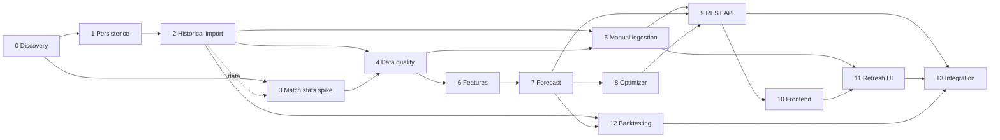

# План дальнейшей разработки Fantasy Analytics

Обновлено: 2026-07-21  
Текущий прогресс: 11 из 14 шагов завершён.

## Цель

Построить локально запускаемую систему, которая по данным Fantasy РПЛ и
футбольной статистике Sports.ru прогнозирует очки игроков и предлагает состав
на следующий тур.

План является рабочим документом. Он содержит планирование, текущие статусы и
ключевые детали/нюансы каждого шага. Подробные карточки выполнения (даты, ветки,
commit/PR, команды проверок и их результаты) и журнал изменений статусов вынесены
в [`docs/development-history.md`](development-history.md).

## Зафиксированные решения

- Backend и аналитика: Python.
- Основная БД: PostgreSQL.
- Frontend: TypeScript и Next.js.
- Sports.ru GraphQL вызывается только сборщиком данных.
- Исходные ответы GraphQL сохраняются до нормализации.
- Обновление данных в первой версии запускается вручную.
- Планировщик и регулярные фоновые обновления пока не нужны.
- Правила состава, лимиты клуба и трансферов берутся из API, а не из констант.
- Авторизация и хранение cookies Sports.ru не входят в первую версию.
- Каждый расчёт прогноза должен иметь версию модели и snapshot входных данных.

## Протокол работы независимого агента

Каждому агенту передаётся только репозиторий и номер одного шага из этого
документа. Контекст предыдущих разговоров не требуется.

Перед реализацией агент обязан:

1. Прочитать `README.md`, `docs/data-model.md` и этот файл.
2. Проверить, что все зависимости шага имеют статус `DONE`.
3. Изменить статус шага на `IN_PROGRESS` в сводной таблице и в карточке шага.
4. Завести карточку выполнения в `docs/development-history.md` и заполнить дату
   начала и идентификатор агента или ветки.
5. Не включать задачи из последующих шагов.

### Пререквизит данных: пустая БД при старте агента

База PostgreSQL в облачном окружении **пуста при каждом старте нового
клауд-агента** (данные из snapshot не сохраняются между запусками). Поэтому
любой шаг, которому нужны доменные данные (матчи, игроки, статистика), обязан
сначала выполнить импорт из шага 2 — это неявная предпосылка всех шагов,
зависящих от содержимого БД:

```bash
PYTHONPATH=src python3 -m fantasy_analytics.db.cli upgrade      # схема
PYTHONPATH=src python3 -m fantasy_analytics.ingest_cli --season-name 2025/2026
```

Проверить наполненность можно так:
`PGPASSWORD=fantasy psql -h localhost -U fantasy -d fantasy -c "SELECT count(*) FROM matches;"`.
Если результат `0`, импорт нужно запустить заново перед началом работы.

После реализации агент обязан:

1. Выполнить все критерии приёмки шага.
2. Записать команды проверок и их результат в карточку шага
   (`docs/development-history.md`).
3. Обновить документацию, если изменились команды или архитектурные решения.
4. Установить статус `DONE` либо `BLOCKED` и добавить в этот файл раздел
   «Ключевые детали и нюансы» с важными решениями шага.
5. Для `DONE` указать в карточке дату, commit/PR и краткий фактический результат.
6. Для `BLOCKED` описать точную причину и необходимое действие.
7. Добавить строку в журнал изменений в `docs/development-history.md`.
8. Пересчитать общий прогресс и перевести доступные следующие шаги в `READY`.
9. Закоммитить обновление плана и истории вместе с результатом шага.

Шаг нельзя помечать `DONE`, если его тесты не проходят. Если реализация
отличается от плана, отклонение и причина фиксируются в карточке истории.

Статусы:

- `PLANNED` — зависимости ещё не завершены.
- `READY` — шаг можно отдавать независимому агенту.
- `IN_PROGRESS` — шаг закреплён за агентом.
- `BLOCKED` — обнаружен внешний или технический блокер.
- `DONE` — критерии приёмки выполнены.

## Сводная таблица

| Шаг | Название | Зависимости | Статус |
| --- | --- | --- | --- |
| 0 | Discovery-прототип и локальный Docker | — | `DONE` |
| 1 | Persistence layer и миграции | 0 | `DONE` |
| 2 | Полный исторический импорт | 1 | `DONE` |
| 3 | Исследование расширенной match-статистики | 0, 2 (данные) | `DONE` |
| 4 | Контроль качества и reconciliation | 2, 3 | `DONE` |
| 5 | Ручной ingestion job и backend-команда | 2, 4 | `DONE` |
| 6 | Аналитические признаки | 4 | `DONE` |
| 7 | Базовая модель прогноза | 6 | `DONE` |
| 8 | Оптимизатор состава | 7 | `DONE` |
| 9 | Пользовательский REST API | 5, 7, 8 | `DONE` |
| 10 | Аналитический frontend | 9 | `DONE` |
| 11 | Ручное обновление из frontend | 5, 10 | `READY` |
| 12 | Backtesting и сравнение моделей | 2, 7 | `PLANNED` |
| 13 | Интеграционная сборка и эксплуатационная готовность | 9, 11, 12 | `PLANNED` |



## Шаги

Для завершённых шагов ниже приведены только цель, зависимости и ключевые
детали/нюансы. Полные карточки выполнения — в
[`docs/development-history.md`](development-history.md).

### Шаг 0. Discovery-прототип и локальный Docker

Статус: `DONE`

Цель: подтвердить доступность данных Sports.ru и сформировать первичную модель
данных.

Ключевые детали и нюансы:

- CLI для live GraphQL discovery; подтверждены 16 клубов, 30 туров, 240 матчей и
  590 fantasy-записей сезона 2025/2026.
- Ограничения API зафиксированы в `docs/data-model.md`.
- Docker daemon в облачном окружении агента отсутствует — полный запуск Compose
  подтверждается локально.

### Шаг 1. Persistence layer и миграции

Статус: `DONE`

Цель: заменить файловые артефакты полноценной записью нормализованных данных в
PostgreSQL.

Зависимости: шаг 0.

Ключевые детали и нюансы:

- Модели SQLAlchemy 2 (`db/models.py`) — единственный авторитетный источник
  схемы; `schema/postgres.sql` удалён.
- Alembic; драйвер psycopg 3 (`postgresql+psycopg://`); чистая БД одной командой
  `fantasy-migrate upgrade`. Последующие миграции — `alembic revision
  --autogenerate`.
- `IngestionRepository` (`db/repository.py`) транзакционно ведёт статусы
  `ingestion_runs` и идемпотентно пишет `raw_api_responses` (dedup по SHA-256).

### Шаг 2. Полный исторический импорт

Статус: `DONE`

Цель: загрузить прошлый сезон в PostgreSQL на уровне сезона, тура, матча, клуба
и каждого игрока.

Зависимости: шаг 1.

Ключевые детали и нюансы:

- Двухстадийный импортёр (`ingestion.py`): fetch всех страниц с retry/backoff,
  persist в одной транзакции; каталог upsert'ится идемпотентно по внешним id,
  снапшоты версионируются по run.
- Маппинг команд: в `season.tours.matches` приходят stat-слаги, в истории игрока
  — fantasy-id; строятся оба (`stat_team_id→club`, `fantasy_team_id→season_club`).
- Ингест-ран фиксируется отдельной транзакцией от доменного snapshot — при сбое
  частичные данные не публикуются.
- История грузится только для игроков с `fieldMinutes > 0`.
- `fantasy_point_details` пусты: `statDetails` в завершённых матчах пуст (маппинг
  готов и активируется, когда поле начнёт заполняться).

### Шаг 3. Исследование расширенной match-статистики

Статус: `DONE`

Цель: определить, какие футбольные показатели Sports.ru стабильно отдаёт для
матчей РПЛ.

Зависимости: шаг 0. Пререквизит данных: импорт шага 2.

Ключевые детали и нюансы:

- Матч резолвится через `statQueries.football.match(id)` по
  `matches.stat_match_id` без аргумента `source`.
- Надёжны командные удары, владение, угловые, фолы и составы; xG и большинство
  продвинутых по-игроцких метрик ненадёжны и исключены. По-игроцки надёжны
  только голы, карточки, автоголы и созданные моменты.
- Схема БД не менялась (спайк-исследование); предложение по хранению расширенной
  статистики — в `docs/data-model.md` и снимок покрытия в
  `docs/match-stats-coverage.md`.

### Шаг 4. Контроль качества и reconciliation

Статус: `DONE`

Цель: автоматически обнаруживать неполные или противоречивые данные до
аналитических расчётов.

Зависимости: шаги 2 и 3.

Ключевые детали и нюансы:

- Gate `fantasy-quality` (`quality.py`): формализованные blocking/warning
  проверки, нарушения в `data_quality_issues`; snapshot активируется
  (`ingestion_runs.is_active`) только при 0 blocking; ≤1 активный run на сезон
  (частичный unique-индекс).
- Reconciliation клубов и игроков; расхождения внутри 72-часового окна
  корректировки Sports.ru понижаются с `blocking` до `warning`.
- **Важно:** начальная миграция `0001` переписана со «живого»
  `metadata.create_all` на статичный baseline — иначе аддитивные миграции падали
  с `DuplicateTable`. Модели остаются источником схемы, следующие миграции —
  autogenerate.
- `data_quality_issues` перезаписывается целиком на каждый прогон
  (идемпотентность).

### Шаг 5. Ручной ingestion job и backend-команда

Статус: `DONE`

Цель: запускать полное обновление по запросу, без scheduler.

Зависимости: шаги 2 и 4.

Ключевые детали и нюансы:

- FastAPI `fantasy-api` (`api.py`): `POST /admin/ingestion/rpl/refresh` →
  `202`+id (или `409` при активном задании), `GET /admin/ingestion/runs/{id}`,
  `GET /health`. Таблица `ingestion_jobs` (миграция `0003`) — статус переживает
  рестарт API.
- Worker — отдельный `subprocess` (`start_new_session=True`), чтобы импорт
  переживал рестарт API; ядро вынесено в `execute_job`, запуск инъектируется
  (`spawn_worker`).
- Взаимное исключение без Redis: частичный unique-индекс + session-level
  `pg_try_advisory_lock`. Ошибки — с редакцией кредов (`safe_error_message`).

### Шаг 6. Аналитические признаки

Статус: `DONE`

Цель: построить воспроизводимый dataset для прогноза следующего тура.

Зависимости: шаг 4.

Ключевые детали и нюансы:

- `features.py` строит leakage-free dataset из активного snapshot (или
  `--run-id`); cutoff = `transfers_deadline_at` (fallback `starts_at`, затем
  ранний kickoff); матчи целевого тура дополнительно исключаются из истории.
- Признаки: rolling 3/5/10, per-90, сила атаки/защиты клуба и соперника, дни
  отдыха, доступность, отдельно `p_appearance` и `expected_minutes`.
- «Старт» аппроксимируется порогом `field_minutes >= 60` (явного флага состава
  в БД нет).
- Схема БД не менялась: dataset воспроизводим из `(run_id, tour,
  feature_version)` и пишется артефактами; словарь — в
  `docs/feature-dictionary.md`.

### Шаг 7. Базовая модель прогноза

Статус: `DONE`

Цель: получить ожидаемые fantasy-очки каждого доступного игрока следующего тура.

Зависимости: шаг 6.

Ключевые детали и нюансы:

- `forecast.py`: интерпретируемая событийная модель `poisson_events` из
  feature-датасета плюс baseline `season_mean` и `recent_form`.
- Голы команд — Poisson из венью-силы; вероятность сухого матча = `exp(-λ)`;
  вклад событий — из per-90 рейтингов × ожидаемые минуты.
- Таблица начисления `SCORING` (`scoring_version = rpl-2025-2026.1`)
  восстановлена из авторитетных матчевых `points` (правила в API — только
  картинка, `statDetails` пуст); точность реконструкции 83% точно / 96% ±1.
  `expected_points` = сумма `components`.
- Таблица `player_forecasts` (миграция `0004`), запись идемпотентна;
  `features.py` расширен per-90 сейвов/возвратов/жёлтых, `FEATURE_VERSION` →
  `1.1.0`.

### Шаг 8. Оптимизатор состава

Статус: `DONE`

Цель: выбрать валидные 15 игроков, стартовый состав, капитана и скамейку.

Зависимости: шаг 7.

Ключевые детали и нюансы:

- `optimizer.py`: целочисленная модель OR-Tools CP-SAT. Переменные
  `pick`/`start`/`captain`; objective = очки старта + капитан (удваивается) со
  строгим tie-break, минимизирующим расход бюджета. Вице — лучший из оставшихся
  стартовых, скамейка упорядочена по очкам (запасной вратарь в конце).
- Лимиты берутся из БД: бюджет и позиционные лимиты из `season_rules`, клубный
  лимит и лимит трансферов из `fantasy_tours` — ничего не захардкожено.
- Режимы `squad` (новый состав) и `transfers` (не более лимита тура;
  `--max-transfers` переопределяет). Независимый `validate_squad`; неразрешимая
  задача — понятный `OptimizerError`.
- Детерминизм: один search-worker, фиксированный seed, детерминированный порядок
  кандидатов. Добавлена зависимость `ortools`; таблиц не добавляет (артефакт
  `optimizer.json`).

### Шаг 9. Пользовательский REST API

Статус: `DONE`

Цель: предоставить frontend стабильный read API для аналитики и оптимизации.

Зависимости: шаги 5, 7 и 8.

Ключевые детали и нюансы:

- Read-слой `read_repository.py` (`ReadRepository`) отдаёт только из PostgreSQL;
  каталог (сезоны, туры, матчи, игроки, клубы) доступен всегда, изменяемые числа
  (цена, доступность, владение, сезонный счёт) — из **активного** snapshot,
  projections и компоненты — из персистентной `player_forecasts` (шаг 7).
- Endpoints (`api.py`, версия приложения `0.2.0`): `GET /seasons[/{id}]`,
  `/tours[/{id}]`, `/matches[/{id}]`, `/players[/{id}]`, `POST /optimizer/squad`
  и `/optimizer/transfers`; админ-эндпоинты шага 5 сохранены в том же приложении.
- Фильтры игроков: `role`, `club_id`, `status`, `min_price`/`max_price`,
  сортировка `order` (`projection`/`price`/`name`/`selected_by`). Projections
  подключаются по `tour_id`+`model` и несут версии модели/признаков/начисления.
- Контракты — Pydantic (`api_schemas.py`); пагинация с верхним лимитом
  (`limit ≤ 200`, `offset ≥ 0`) и детерминированным порядком (tie-break по
  `player_season_id`); единый конверт ошибок
  `{"error": {type, message, details}}` для HTTP- и validation-ошибок.
- OpenAPI генерируется из живого приложения без обращения к БД
  (`openapi_cli.py`, скрипт `fantasy-openapi`) и зафиксирован в
  `docs/openapi.json`. Схема БД не менялась.
- Ошибки оптимизатора (`OptimizerError`) отображаются в `422`
  (`type=optimizer_error`); read-эндпоинты никогда не вызывают Sports.ru GraphQL.

### Шаг 10. Аналитический frontend

Статус: `DONE`

Цель: показать данные следующего тура и позволить собрать состав.

Зависимости: шаг 9.

Ключевые детали и нюансы:

- Next.js 15 (App Router) + TypeScript в `frontend/`. Все запросы браузера идут
  same-origin через прокси `/api/backend/*` (rewrite в `next.config.mjs` на
  `BACKEND_URL`) — CORS не нужен; server-компоненты обращаются к backend напрямую
  по `BACKEND_URL`. TS-типы и API-клиент повторяют `docs/openapi.json`.
- Страница тура: селектор тура, таблица игроков с фильтрами (позиция, клуб,
  статус, диапазон цены), серверная сортировка (`order`), пагинация с верхним
  лимитом и сравнение до 4 игроков. Карточка игрока (drawer + маршрут
  `/players/[id]`) показывает историю матчей и разложение прогноза по компонентам
  начисления. Свежесть снапшота и версия модели — в шапке.
- Конструктор состава валидирует все правила ростера на клиенте (`lib/squad.ts`:
  размер, позиционные лимиты, бюджет, клубный лимит, дубли), зеркаля
  `optimizer.parse_role_limits`; отправка трансферов заблокирована до валидного
  состава из 15 игроков. Кнопка «Автосостав» вызывает `/optimizer/squad`, режим
  трансферов — `/optimizer/transfers`; результат оптимизатора автоматически
  загружается в конструктор, чтобы сводка оставалась согласованной.
- Дефолтный тур = следующий несыгранный, иначе последний (сезон завершён). Для
  наполнения проекций нужен предварительный `fantasy-forecast --tour <id>`
  (в демо — туры 15 и 30). Состояния loading/empty/error покрыты во всех вью,
  вёрстка адаптивная (desktop/mobile).
- Тесты: Vitest (25, unit-логика валидации + компоненты) и Playwright e2e
  (6 сценариев против живого backend). Compose расширен сервисами `api` и
  `frontend`; для фронтенда — standalone `Dockerfile`.

Не входит: ручное обновление данных и авторизация (шаг 11).

### Шаг 11. Ручное обновление из frontend

Статус: `READY`

Цель: дать пользователю безопасную кнопку обновления перед туром.

Зависимости: шаги 5 и 10.

Детали:

- Добавить административный экран обновления.
- Показывать этап, прогресс и время запуска job.
- Polling использовать только пока job не завершён.
- Блокировать повторный запуск при активном задании.
- После успеха обновлять данные и показывать новый snapshot.
- После ошибки показывать безопасное сообщение и возможность повтора.

Критерии приёмки:

- Кнопка запускает реальный ingestion job.
- Перезагрузка страницы не теряет состояние задания.
- Повторный клик не создаёт параллельный импорт.
- UI показывает последний успешный snapshot и целевой тур.
- Сценарии success/failure покрыты e2e тестом.

Не входит: scheduler и уведомления.

### Шаг 12. Backtesting и сравнение моделей

Статус: `PLANNED`

Цель: проверить, улучшает ли прогноз выбор состава на исторических турах.

Зависимости: шаги 2 и 7.

Детали:

- Последовательно симулировать туры без доступа к будущим данным.
- Сравнить модель со средними очками, формой и value baseline.
- Измерять MAE/RMSE прогноза и очки оптимального состава.
- Отдельно оценивать позиции, стартовый состав и капитана.
- Сохранять параметры запуска и результаты.
- Добавить отчёт с ошибками и наиболее нестабильными признаками.

Критерии приёмки:

- Cutoff каждого тура проверяется автоматически.
- Результат воспроизводим одной командой.
- Есть сравнение минимум с двумя простыми baseline.
- Метрики представлены по турам и позициям.
- Вывод содержит решение: принять модель, изменить или оставить baseline.

Не входит: live A/B-тест.

### Шаг 13. Интеграционная сборка и эксплуатационная готовность

Статус: `PLANNED`

Цель: запускать полную первую версию локально и на одном сервере.

Зависимости: шаги 9, 11 и 12.

Детали:

- Расширить Compose сервисами API, worker, frontend и PostgreSQL.
- Добавить healthchecks, dependency ordering и graceful shutdown.
- Добавить CI для lint, unit, integration и frontend tests.
- Добавить миграции при развёртывании и проверку совместимости схемы.
- Документировать backup/restore и безопасные локальные secrets.
- Добавить structured logs и endpoint состояния компонентов.

Критерии приёмки:

- Чистый checkout запускается документированной командой.
- Пользователь может обновить данные и получить состав через UI.
- Перезапуск контейнеров не теряет БД и job status.
- CI проходит на чистом окружении.
- README содержит полный smoke-test первой версии.

Не входит: Kubernetes, autoscaling и многопользовательская SaaS-эксплуатация.
