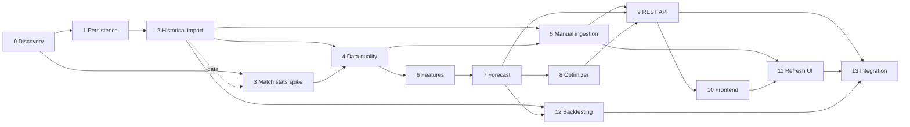

# План дальнейшей разработки Fantasy Analytics

Обновлено: 2026-07-21  
Текущий прогресс: 6 из 14 шагов завершён.

## Цель

Построить локально запускаемую систему, которая по данным Fantasy РПЛ и
футбольной статистике Sports.ru прогнозирует очки игроков и предлагает состав
на следующий тур.

План является рабочим документом. Агент, выполняющий шаг, обязан обновить этот
файл перед началом работы и после её завершения.

## Зафиксированные решения

- Backend и аналитика: Python.
- Основная БД: PostgreSQL.
- Frontend: TypeScript и Next.js.
- Sports.ru GraphQL вызывается только сборщиком данных.
- Исходные ответы GraphQL сохраняются до нормализации.
- Обновление данных в первой версии запускается вручную.
- Планировщик и регулярные фоновые обновления пока не нужны.
- Правила состава, лимиты клуба и трансферов берутся из API, а не из констант.
- Авторизация и хранение cookies Sports.ru не входят в первую версию.
- Каждый расчёт прогноза должен иметь версию модели и snapshot входных данных.

## Протокол работы независимого агента

Каждому агенту передаётся только репозиторий и номер одного шага из этого
документа. Контекст предыдущих разговоров не требуется.

Перед реализацией агент обязан:

1. Прочитать `README.md`, `docs/data-model.md` и этот файл.
2. Проверить, что все зависимости шага имеют статус `DONE`.
3. Изменить статус шага на `IN_PROGRESS` в сводной таблице и в его карточке.
4. Заполнить дату начала и идентификатор агента или ветки.
5. Не включать задачи из последующих шагов.

### Пререквизит данных: пустая БД при старте агента

База PostgreSQL в облачном окружении **пуста при каждом старте нового
клауд-агента** (данные из snapshot не сохраняются между запусками). Поэтому
любой шаг, которому нужны доменные данные (матчи, игроки, статистика), обязан
сначала выполнить импорт из шага 2 — это неявная предпосылка всех шагов,
зависящих от содержимого БД:

```bash
PYTHONPATH=src python3 -m fantasy_analytics.db.cli upgrade      # схема
PYTHONPATH=src python3 -m fantasy_analytics.ingest_cli --season-name 2025/2026
```

Проверить наполненность можно так:
`PGPASSWORD=fantasy psql -h localhost -U fantasy -d fantasy -c "SELECT count(*) FROM matches;"`.
Если результат `0`, импорт нужно запустить заново перед началом работы.

После реализации агент обязан:

1. Выполнить все критерии приёмки шага.
2. Записать команды проверок и их результат в карточку шага.
3. Обновить документацию, если изменились команды или архитектурные решения.
4. Установить статус `DONE` либо `BLOCKED`.
5. Для `DONE` указать дату, commit/PR и краткий фактический результат.
6. Для `BLOCKED` описать точную причину и необходимое действие.
7. Добавить строку в журнал изменений в конце этого файла.
8. Пересчитать общий прогресс и перевести доступные следующие шаги в `READY`.
9. Закоммитить обновление плана вместе с результатом шага.

Шаг нельзя помечать `DONE`, если его тесты не проходят. Если реализация
отличается от плана, отклонение и причина фиксируются в карточке.

Статусы:

- `PLANNED` — зависимости ещё не завершены.
- `READY` — шаг можно отдавать независимому агенту.
- `IN_PROGRESS` — шаг закреплён за агентом.
- `BLOCKED` — обнаружен внешний или технический блокер.
- `DONE` — критерии приёмки выполнены.

## Сводная таблица

| Шаг | Название | Зависимости | Статус |
| --- | --- | --- | --- |
| 0 | Discovery-прототип и локальный Docker | — | `DONE` |
| 1 | Persistence layer и миграции | 0 | `DONE` |
| 2 | Полный исторический импорт | 1 | `DONE` |
| 3 | Исследование расширенной match-статистики | 0, 2 (данные) | `DONE` |
| 4 | Контроль качества и reconciliation | 2, 3 | `DONE` |
| 5 | Ручной ingestion job и backend-команда | 2, 4 | `DONE` |
| 6 | Аналитические признаки | 4 | `READY` |
| 7 | Базовая модель прогноза | 6 | `PLANNED` |
| 8 | Оптимизатор состава | 7 | `PLANNED` |
| 9 | Пользовательский REST API | 5, 7, 8 | `PLANNED` |
| 10 | Аналитический frontend | 9 | `PLANNED` |
| 11 | Ручное обновление из frontend | 5, 10 | `PLANNED` |
| 12 | Backtesting и сравнение моделей | 2, 7 | `PLANNED` |
| 13 | Интеграционная сборка и эксплуатационная готовность | 9, 11, 12 | `PLANNED` |



## Шаги

### Шаг 0. Discovery-прототип и локальный Docker

Статус: `DONE`

Задача: подтвердить доступность данных Sports.ru и сформировать первичную модель
данных.

Фактический результат:

- Работает CLI для live GraphQL discovery.
- Подтверждены 16 клубов, 30 туров, 240 матчей и 590 fantasy-записей игроков
  сезона 2025/2026.
- Добавлены `schema/postgres.sql`, Dockerfile и Compose с PostgreSQL 18.
- Зафиксированы ограничения API в `docs/data-model.md`.
- Проходят 13 unit-тестов.

Карточка выполнения:

- Начат: 2026-07-19
- Завершён: 2026-07-19
- Commit: `ac9be65`
- Проверки: unit-тесты, live discovery, статическая проверка Compose.
- Отклонения: Docker daemon отсутствовал в агентском окружении; полный Compose
  запуск должен быть подтверждён локально.

### Шаг 1. Persistence layer и миграции

Статус: `DONE`

Цель: заменить файловые артефакты полноценной записью нормализованных данных в
PostgreSQL.

Зависимости: шаг 0.

Детали:

- Выбрать и настроить SQLAlchemy 2 и Alembic.
- Преобразовать `schema/postgres.sql` в версионируемые миграции.
- Оставить один авторитетный способ изменения схемы, исключив расхождение DDL и
  миграций.
- Добавить конфигурацию `DATABASE_URL`, транзакции и repository layer.
- Реализовать persistence для `ingestion_runs` и `raw_api_responses`.
- Добавить интеграционные тесты с PostgreSQL из Compose.

Критерии приёмки:

- Новая БД создаётся с нуля одной командой.
- Миграции применяются и откатываются в тестовом окружении.
- Raw GraphQL payload и статус запуска сохраняются транзакционно.
- Повторная запись одного payload не создаёт дубликат.
- Unit- и integration-тесты проходят.

Не входит: полный импорт всех доменных таблиц.

Фактический результат:

- Модели SQLAlchemy 2 (`src/fantasy_analytics/db/models.py`) — единственный
  авторитетный источник схемы; файл `schema/postgres.sql` удалён.
- Настроен Alembic; начальная миграция `0001` материализует метаданные моделей
  (применяется и откатывается). Проверено `compare_metadata`: расхождений нет.
- Добавлены engine/session helpers, `session_scope` и конфигурация
  `DATABASE_URL` (`db/config.py`).
- `IngestionRepository` (`db/repository.py`) транзакционно управляет статусами
  `ingestion_runs` и идемпотентно пишет `raw_api_responses` (dedup по SHA-256
  хешу ответа и unique-констрейнту).
- Добавлены CLI `fantasy-migrate` и сервис `migrate` в Compose/Make; чистая БД
  создаётся одной командой `make migrate` (или `fantasy-migrate upgrade`).

Карточка выполнения:

- Начат: 2026-07-20
- Завершён: 2026-07-20
- Агент/ветка: `cursor/persistence-layer-migrations-bd72`
- Commit/PR: `0b9d2d2`
- Проверки:
  - `python -m fantasy_analytics.db.cli upgrade/downgrade` на PostgreSQL 16 —
    18 таблиц создаются и полностью удаляются.
  - `fantasy-migrate upgrade` на чистой БД создаёт схему одной командой.
  - `compare_metadata(models, db)` — 0 расхождений (DDL и модели совпадают).
  - `python -m unittest discover -s tests` — 24 теста проходят (с БД);
    без БД 9 интеграционных тестов корректно пропускаются.
  - `python -m build --wheel` — миграции и mako попадают в дистрибутив.
- Решения и отклонения:
  - Начальная миграция использует `metadata.create_all/drop_all` вместо
    статичных `op.create_table`, чтобы гарантировать единый источник схемы и
    исключить дрейф между ORM и DDL. Последующие миграции должны использовать
    `alembic revision --autogenerate`.
  - Драйвер — psycopg 3 (`postgresql+psycopg://`).
  - Docker daemon в окружении агента отсутствовал; интеграция проверена на
    локально установленном PostgreSQL 16, полный запуск Compose должен быть
    подтверждён локально (аналогично шагу 0).

### Шаг 2. Полный исторический импорт

Статус: `DONE`

Цель: загрузить прошлый сезон в PostgreSQL на уровне сезона, тура, матча, клуба
и каждого игрока.

Зависимости: шаг 1.

Детали:

- Сохранять турнир, сезон, правила, клубы, туры и матчи.
- Загружать все страницы игроков, snapshots и сезонные агрегаты.
- Загружать match history всех игроков с игровыми минутами.
- Делать idempotent upsert по внешним идентификаторам.
- Добавить retry, backoff, ограничение параллелизма и понятный progress output.
- Поддержать `--season-id`, `--season-name` и последний завершённый сезон.

Критерии приёмки:

- Для 2025/2026 сохранены 16 клубов, 30 туров и 240 матчей.
- Сохранены все 590 fantasy-записей и match history игроков с минутами.
- Повторный запуск не меняет количество логических сущностей.
- Ошибка одной страницы не публикует частично успешный snapshot.
- Итоговый отчёт содержит количество записей и длительность каждой стадии.

Не входит: расширенная статистика `statMatch`.

Фактический результат:

- Добавлен двухстадийный импортёр (`src/fantasy_analytics/ingestion.py`):
  стадия fetch скачивает все страницы (турнир, сезон, все страницы игроков,
  клубные сезонные агрегаты, историю матчей каждого игрока с минутами) с
  retry/backoff клиента и ограниченным пулом потоков; стадия persist пишет всё
  в одной транзакции.
- `src/fantasy_analytics/db/import_repository.py` — идемпотентные bulk-upsert'ы
  каталога по внешним идентификаторам и вставка run-scoped снапшотов.
- Добавлены CLI `fantasy-ingest` и консольная точка входа с выбором сезона
  (`--season-id`, `--season-name`, `--current`, `--history-workers`).
- Отчёт запуска содержит счётчики по всем сущностям и длительность каждой
  стадии; каждый запуск учитывается в `ingestion_runs` с версионированным
  отчётом.

Карточка выполнения:

- Начат: 2026-07-21
- Завершён: 2026-07-21
- Агент/ветка: `cursor/full-historical-import-d9c2`
- Commit/PR: PR #4
- Проверки:
  - Боевой импорт сезона 2025/2026 в чистую БД: 16 клубов, 16 season_clubs,
    30 туров, 240 матчей, 590 игроков и player_seasons, 9578 player_match_stats,
    480 club_match_stats, 16 club_season_stats; history загружена для 423
    игроков с минутами, `skipped_history_matches = 0`. Стадии: fetch ~27.3s,
    persist ~4.0s.
  - Идемпотентность: повторный запуск не изменил каталог (clubs 16, matches 240,
    player_seasons 590, player_match_stats 9578, club_match_stats 480), а
    run-scoped снапшоты выросли на одно поколение (fantasy_player_snapshots
    590→1180, player_season_stats 590→1180, club_season_stats 16→32).
  - Сверка данных: все 240 матчей имеют счёт и тур; сумма ролей = 590; агрегат
    топ-игрока (Сперцян: 225 очков, 13 голов, 16 передач, 2543 минуты) совпадает
    с `gameStat` из API; club_match_stats = 240 домашних + 240 гостевых.
  - `python -m unittest discover -s tests` — 33 теста проходят (юнит + БД),
    включая интеграционные тесты идемпотентности и «сбой не публикует
    частичный snapshot».
- Решения и отклонения:
  - Команды в `season.tours.matches.home/away.team.id` приходят как stat-слаги,
    а в истории игрока `match.team.id` — как fantasy-id; импортёр строит оба
    маппинга (stat_team_id→club, fantasy_team_id→season_club).
  - Ингест-ран фиксируется отдельной транзакцией от доменного snapshot: при
    сбое запуск помечается `failed`, а доменная транзакция откатывается целиком,
    не публикуя частичных данных.
  - История загружается только для игроков с `fieldMinutes > 0` (423 из 590):
    у игроков без минут история пуста, лишние запросы исключены.
  - `fantasy_point_details` пусты: `statDetails` в завершённых матчах приходит
    пустым (подтверждено в шаге 0), маппинг реализован и активируется, когда
    поле начнёт заполняться. Расширенная `statMatch`-статистика — вне объёма.

### Шаг 3. Исследование расширенной match-статистики

Статус: `DONE`

Цель: определить, какие футбольные показатели Sports.ru стабильно отдаёт для
матчей РПЛ.

Зависимости: шаг 0. Пререквизит данных: импорт шага 2 (БД пуста при старте
клауд-агента), выборка матчей берётся из каталога.

Детали:

- Исследовать `statMatch`, составы, события и player match stats.
- Проверить удары, xG, владение, сейвы, стандарты, карточки и минуты.
- Взять выборку минимум из 30 матчей разных клубов и частей сезона.
- Для каждого поля измерить заполненность и согласованность.
- Сохранить raw fixtures и отчёт field coverage.
- Предложить минимальные изменения модели данных, но не строить прогноз.

Критерии приёмки:

- Есть таблица `GraphQL path → тип → заполненность → решение`.
- Запросы воспроизводимы отдельной CLI-командой.
- Ненадёжные и отсутствующие поля явно исключены.
- Документированы идентификаторы для связи Fantasy и stat API.
- Добавлены контрактные тесты для выбранных операций.

Не входит: массовая загрузка и ML.

Фактический результат:

- Добавлена операция `statQueries.football.match(id)` (`queries.py`,
  `build_match_stats_query`) с флагами наличия, командной и по-игроцкой
  статистикой, составами и лентой событий.
- Модуль `src/fantasy_analytics/match_stats.py`: воспроизводимая выборка
  матчей (равномерно по сезону + покрытие всех клубов), измерение заполненности
  каждого GraphQL-пути, классификация решений (`ADOPT`/`CONDITIONAL`/`SPARSE`/
  `EXCLUDE`) и сверка со счётом каталога.
- CLI `fantasy-match-stats` (`match_stats_cli.py`) читает матчи из БД, пишет raw
  fixtures, `field-coverage.json/md`, `match-consistency.json` и `report.json`.
- Снимок таблицы покрытия зафиксирован в `docs/match-stats-coverage.md`; выводы
  и маппинг добавлены в `docs/data-model.md`.

Критерии приёмки (выполнено):

- Таблица `GraphQL path → тип → заполненность → решение` — `docs/match-stats-coverage.md`.
- Запросы воспроизводимы одной CLI-командой `fantasy-match-stats`.
- Ненадёжные и отсутствующие поля явно помечены `SPARSE`/`EXCLUDE`.
- Идентификаторы связи Fantasy↔stat документированы (stat-слаги команд и игроков).
- Добавлены контрактные тесты выбранной операции (fake-transport + live по флагу).

Карточка выполнения:

- Начат: 2026-07-21
- Завершён: 2026-07-21
- Агент/ветка: `cursor/step3-match-stats-spike-e44d`
- Commit/PR: PR по ветке `cursor/step3-match-stats-spike-e44d`
- Проверки:
  - Боевой прогон `fantasy-match-stats --season-name 2025/2026 --sample-size 40`:
    40 матчей, 16 клубов, 30 туров; `hasDetailStat/hasLineups/hasEvents/
    hasPersonStat` = 40/40, `hasXG` = 10/40; сверка счёта с каталогом 40/40;
    11 стартовых игроков у каждой стороны 40/40. 50 из 113 полей `ADOPT`.
  - `python -m unittest discover -s tests` — 45 тестов (44 + 1 live-skip)
    проходят; live-контракт подтверждён `RUN_LIVE_MATCH_STATS=1`.
- Решения и отклонения:
  - Матч резолвится через `statQueries.football.match(id)` по
    `matches.stat_match_id` без аргумента `source`; корневой `match(ID)`
    относится к контент-матчу и отдаёт `NOT_FOUND` для stat-id.
  - xG для РПЛ ненадёжен (`hasXG` только у части матчей, поля пусты) — вынесен в
    опциональные и не адаптируется.
  - По-игроцкая статистика скудная: надёжны только голы, карточки, автоголы и
    созданные моменты; пасовые/дуэльные разбивки и xG исключены.
  - Схема БД в этом шаге не менялась (спайк-исследование), предложение по
    хранению расширенной статистики описано в `docs/data-model.md`.

### Шаг 4. Контроль качества и reconciliation

Статус: `DONE`

Цель: автоматически обнаруживать неполные или противоречивые данные до
аналитических расчётов.

Зависимости: шаги 2 и 3.

Детали:

- Проверять количество туров, матчей, клубов и игроков.
- Сверять результаты матчей с клубными сезонными агрегатами.
- Сверять сумму player-match очков с сезонными fantasy-очками.
- Проверять минуты, роли, внешние ID и обязательные связи.
- Учитывать 72-часовое окно корректировки статистики Sports.ru.
- Сохранять нарушения в `data_quality_issues`.

Критерии приёмки:

- Есть формализованный набор blocking и warning проверок.
- Некорректный snapshot не становится активным.
- Отчёт показывает ожидаемое и фактическое значение каждой проверки.
- Fixtures покрывают пропущенную страницу, дубль ID и изменение результата.

Не входит: исправление данных вручную через UI.

Фактический результат:

- Добавлена таблица `data_quality_issues` (severity `blocking`/`warning`,
  `expected`/`actual`, `details`) и поля `season_id`, `is_active`,
  `quality_checked_at` в `ingestion_runs`. Частичный уникальный индекс
  `ingestion_runs_active_season_idx` гарантирует не более одного активного
  run на сезон.
- Модуль `src/fantasy_analytics/quality.py`: формализованный набор проверок
  (`catalog_completeness`, `reference_integrity`, `duplicate_fixtures`,
  `match_score_completeness`, `club_result_reconciliation`,
  `player_points_reconciliation`). Reconciliation сверяет клубные сезонные
  агрегаты с результатами из `club_match_stats` и сезонный fantasy-итог игрока
  с суммой его матчевой статистики. Расхождения по матчам внутри 72-часового
  окна корректировки понижаются с `blocking` до `warning`.
- `QualityRepository` (`db/quality_repository.py`) идемпотентно перезаписывает
  issues run'а и публикует snapshot: при отсутствии blocking — помечает run
  активным и деактивирует прочие активные run'ы сезона; при наличии blocking —
  оставляет неактивным, не вытесняя последний валидный snapshot.
- CLI `fantasy-quality` (`quality_cli.py`) печатает JSON-отчёт с ожидаемым и
  фактическим значением каждой проверки и возвращает код 1 при blocking.

Критерии приёмки (выполнено):

- Формализованный набор blocking/warning проверок — таблица в
  `docs/data-model.md`, раздел «Data quality gate (step 4)».
- Некорректный snapshot не становится активным: `is_active` выставляется только
  при 0 blocking (подтверждено на реальных данных и integration-тестами).
- Отчёт показывает ожидаемое и фактическое значение каждой проверки (поля
  `expected`/`actual` в отчёте и в `data_quality_issues`).
- Fixtures покрывают пропущенную страницу (игрок с минутами без истории →
  blocking), дубль ID (повтор fixture → blocking) и изменение результата
  (рассинхрон агрегата → blocking вне окна, warning внутри 72ч).

Карточка выполнения:

- Начат: 2026-07-21
- Завершён: 2026-07-21
- Агент/ветка: `cursor/step4-data-quality-reconciliation-a55e`
- Commit/PR: PR по ветке `cursor/step4-data-quality-reconciliation-a55e`
- Проверки:
  - `python -m unittest discover -s tests` — 57 тестов проходят (было 45),
    1 live-skip; добавлен `tests/test_quality.py` (12 тестов: unit + сценарии
    missing page, duplicate id, result change и окно 72ч).
  - Миграции: чистая цепочка `base → 0001 → 0002` создаёт 18 таблиц,
    `compare_metadata(models, db)` = 0 расхождений; `downgrade`/`upgrade`
    по ревизиям проходят.
  - Боевой прогон на сезоне 2025/2026 (16/30/240, 590 игроков, 9578 match-stats):
    `fantasy-quality` — PASSED, 0 blocking, 0 warning, snapshot активен;
    `club_result_reconciliation` сверил 16 клубов (0 mismatch),
    `player_points_reconciliation` — 590 игроков (0 missing_history, 0 mismatch).
  - Негативный боевой прогон: внедрён дубликат матча → gate BLOCKED (exit 1),
    issue записан (`expected=1`, `actual=2`), `is_active=false`; после удаления
    дубликата повторный прогон — PASSED, snapshot снова активен, issues очищены.
- Решения и отклонения:
  - Начальная миграция `0001` переписана со «живого» `metadata.create_all`
    на статичный явный baseline (снимок схемы после шага 2). Прежний подход
    делал невозможной любую аддитивную миграцию: `create_all` уже создавал новую
    таблицу/колонки, и `0002` падал с `DuplicateTable`. Модели по-прежнему —
    единственный источник текущей схемы; последующие миграции используют
    `alembic revision --autogenerate` (как и предписано в карточке шага 1).
  - Reconciliation по-игрокам и по-клубам на завершённом сезоне сходится точно,
    поэтому blocking-строгость безопасна (нет ложных срабатываний). Внутри окна
    72ч рассинхроны понижаются до warning.
  - `data_quality_issues` перезаписывается целиком на каждый прогон (delete+
    insert), обеспечивая идемпотентность.

### Шаг 5. Ручной ingestion job и backend-команда

Статус: `DONE`

Цель: запускать полное обновление по запросу, без scheduler.

Зависимости: шаги 2 и 4.

Детали:

- Добавить FastAPI-приложение.
- Реализовать `POST /admin/ingestion/rpl/refresh`.
- Реализовать `GET /admin/ingestion/runs/{id}`.
- Выполнять импорт отдельным worker-процессом.
- Использовать PostgreSQL job table и advisory lock вместо Redis.
- Публиковать snapshot только после успешного импорта и проверок.

Критерии приёмки:

- API сразу возвращает `202` и ID задания.
- Одновременно выполняется не более одного refresh турнира.
- Статусы `pending/running/succeeded/failed` сохраняются после перезапуска API.
- Ошибка содержит безопасное диагностическое сообщение.
- Успешный запуск обновляет время актуальности данных.

Не входит: кнопка во frontend и автоматический запуск.

Фактический результат:

- Добавлена таблица `ingestion_jobs` (модель `IngestionJob`, миграция `0003`):
  статусы `pending/running/succeeded/failed`, ссылка `ingestion_run_id` на
  порождённый импорт, `result` (JSONB) и `error_message`. Частичный уникальный
  индекс `ingestion_jobs_active_tournament_idx` гарантирует не более одного
  активного (`pending`/`running`) задания на турнир.
- `IngestionJobRepository` (`db/job_repository.py`) идемпотентно ставит задание
  в очередь (возвращает существующее активное вместо дубликата) и переводит его
  по жизненному циклу; хелпер `advisory_lock_key` детерминированно отображает
  слуг турнира в ключ advisory-lock.
- Worker `fantasy-ingestion-worker` (`ingestion_worker.py`) исполняется
  **отдельным процессом**: берёт session-level `pg_try_advisory_lock` по турниру,
  помечает задание `running`, запускает импорт (шаг 2) и затем gate качества
  (шаг 4), публикующий snapshot только при 0 blocking, и записывает объединённый
  `result` (счётчики импорта, отчёт качества, `data_freshness`,
  `snapshot_active`) либо безопасное сообщение об ошибке (редакция кредов).
- FastAPI-приложение `fantasy-api` (`api.py`): `POST /admin/ingestion/rpl/refresh`
  ставит задание в очередь, сразу возвращает `202` с id и запускает worker
  отдельным `subprocess` (`start_new_session=True`); при активном задании
  возвращает `409`. `GET /admin/ingestion/runs/{id}` читает задание из БД.
  `GET /health` — проба готовности. Тело запроса позволяет выбрать сезон
  (`season_id`/`season_name`/`current`), по умолчанию — последний завершённый.

Критерии приёмки (выполнено):

- API сразу возвращает `202` и ID задания — боевой POST вернул `202` за 0.03s.
- Одновременно не более одного refresh турнира — второй POST во время импорта
  вернул `409`; защита на двух уровнях (частичный unique-индекс + advisory lock,
  проверено тестом на удержании чужого lock).
- Статусы `pending/running/succeeded/failed` переживают перезапуск API —
  после Ctrl-C и повторного старта `GET /runs/1` вернул `succeeded`.
- Ошибка содержит безопасное диагностическое сообщение — креды в строке
  подключения редактируются (`safe_error_message`, unit-тест).
- Успешный запуск обновляет время актуальности — `result.data_freshness`
  устанавливается в `finished_at` опубликованного run.

Карточка выполнения:

- Начат: 2026-07-21
- Завершён: 2026-07-21
- Агент/ветка: `cursor/step5-manual-ingestion-job-7eae`
- Commit/PR: PR по ветке `cursor/step5-manual-ingestion-job-7eae`
- Проверки:
  - `python -m unittest discover -s tests` — 72 теста проходят (было 57),
    1 live-skip; добавлены `tests/test_api.py` (9) и
    `tests/test_ingestion_worker.py` (6): успех/сбой worker, mutual exclusion по
    advisory lock, пропуск не-`pending` задания, `202`/`409`/`404`, персистентность
    статуса после «перезапуска» API, e2e refresh с реальным импортом.
  - Миграции: цепочка `0002 → 0003` создаёт `ingestion_jobs`,
    `downgrade`/`upgrade` проходят, `compare_metadata` = 0 расхождений.
  - Боевой e2e через `fantasy-api` + worker-subprocess на живом API Sports.ru:
    `POST /admin/ingestion/rpl/refresh` → `202` (0.03s), задание прошло
    `pending → running → succeeded` за ~46s, импортировано 16 клубов, 30 туров,
    240 матчей, 590 игроков, 9578 player_match_stats; gate качества — 0 blocking,
    0 warning, `ingestion_runs.is_active = true`, `data_freshness` заполнен.
    Параллельный POST во время импорта → `409`; после Ctrl-C + рестарта API
    `GET /runs/1` = `succeeded` (статус переживает перезапуск).
- Решения и отклонения:
  - Введена отдельная таблица `ingestion_jobs` (админ-уровень) поверх
    `ingestion_runs` (внутренний импорт): задание ссылается на порождённый run
    через `ingestion_run_id`. Путь `GET /admin/ingestion/runs/{id}` принимает id
    задания (возвращаемый refresh-эндпоинтом): «run» здесь трактуется как
    админ-уровневый refresh-run.
  - Worker запускается как самостоятельный `subprocess` (не `multiprocessing`),
    отвязанный через `start_new_session=True`, чтобы импорт переживал рестарт API.
    Для тестируемости ядро вынесено в импортируемую `execute_job`, а запуск
    worker'а в API инъектируется (`spawn_worker`).
  - Redis не используется: взаимное исключение — частичный unique-индекс +
    session-level advisory lock (`pg_try_advisory_lock`, AUTOCOMMIT-соединение,
    освобождается в `finally`).

### Шаг 6. Аналитические признаки

Статус: `READY`

Цель: построить воспроизводимый dataset для прогноза следующего тура.

Зависимости: шаг 4.

Детали:

- Рассчитать rolling-метрики игроков за 3, 5 и 10 матчей.
- Рассчитать per-90 показатели и долю матчей в стартовом составе.
- Рассчитать домашнюю и гостевую силу атаки/защиты клубов.
- Добавить силу соперника, отдых и статус доступности.
- Отдельно оценивать вероятность выхода и ожидаемые минуты.
- Исключить leakage: признаки используют только данные до дедлайна тура.

Критерии приёмки:

- Dataset строится одной командой для указанного тура.
- Каждая строка имеет `player`, `tour`, cutoff time и версию признаков.
- Unit-тесты подтверждают rolling windows и отсутствие будущих матчей.
- Пропуски имеют явную стратегию заполнения.
- Словарь признаков документирован.

Не входит: выбор финального ML-алгоритма.

Карточка выполнения:

- Начат:
- Завершён:
- Агент/ветка:
- Commit/PR:
- Проверки:
- Решения и отклонения:

### Шаг 7. Базовая модель прогноза

Статус: `PLANNED`

Цель: получить ожидаемые fantasy-очки каждого доступного игрока следующего
тура.

Зависимости: шаг 6.

Детали:

- Построить интерпретируемый baseline, начиная с ожидаемых минут.
- Оценить голы команд Poisson-моделью.
- Оценить вклад голов, ассистов, сухих матчей, сейвов и возвратов.
- Конвертировать события в очки по правилам выбранного сезона.
- Сохранять expected points, uncertainty и компоненты прогноза.
- Версионировать модель, параметры и snapshot данных.

Критерии приёмки:

- Прогноз строится для всех доступных игроков тура.
- Сумма компонентов объясняет итоговый expected points.
- Повторный расчёт на одинаковом snapshot детерминирован.
- Есть простые baselines: средние очки и последние N матчей.
- Результаты сохраняются в БД с версией модели.

Не входит: нейросети и автоматический подбор гиперпараметров.

Карточка выполнения:

- Начат:
- Завершён:
- Агент/ветка:
- Commit/PR:
- Проверки:
- Решения и отклонения:

### Шаг 8. Оптимизатор состава

Статус: `PLANNED`

Цель: выбрать валидные 15 игроков, стартовый состав, капитана и скамейку.

Зависимости: шаг 7.

Детали:

- Использовать OR-Tools CP-SAT или эквивалентный целочисленный solver.
- Получать бюджет и позиционные лимиты из `season_rules`.
- Получать club limit и трансферы из конкретного тура.
- Поддержать стартовые схемы, капитана, вице-капитана и порядок скамейки.
- Добавить режим нового состава и режим ограниченных трансферов.
- Возвращать объяснение выбора и неиспользованный бюджет.

Критерии приёмки:

- Каждый результат проходит отдельный validator правил.
- Есть fixtures для обычного тура и тура с изменённым лимитом трансферов.
- Solver сообщает понятную ошибку для неразрешимой задачи.
- Objective соответствует сумме ожидаемых очков с учётом капитана.
- Результат детерминирован при одинаковых входах.

Не входит: автоматическая отправка состава на Sports.ru.

Карточка выполнения:

- Начат:
- Завершён:
- Агент/ветка:
- Commit/PR:
- Проверки:
- Решения и отклонения:

### Шаг 9. Пользовательский REST API

Статус: `PLANNED`

Цель: предоставить frontend стабильный read API для аналитики и оптимизации.

Зависимости: шаги 5, 7 и 8.

Детали:

- Добавить endpoints сезонов, туров, матчей и игроков.
- Добавить фильтры по позиции, клубу, цене и статусу.
- Добавить выдачу projections и объясняющих компонентов.
- Добавить `POST /optimizer/squad` и `POST /optimizer/transfers`.
- Ввести Pydantic-контракты, пагинацию и единый формат ошибок.
- Сгенерировать и зафиксировать OpenAPI schema.

Критерии приёмки:

- API покрыт unit- и integration-тестами.
- OpenAPI отражает реальные request/response модели.
- Пагинация стабильна и имеет верхний лимит.
- В ответах есть время snapshot и версия модели.
- GraphQL Sports.ru никогда не вызывается из read endpoints.

Не входит: публичная регистрация пользователей.

Карточка выполнения:

- Начат:
- Завершён:
- Агент/ветка:
- Commit/PR:
- Проверки:
- Решения и отклонения:

### Шаг 10. Аналитический frontend

Статус: `PLANNED`

Цель: показать данные следующего тура и позволить собрать состав.

Зависимости: шаг 9.

Детали:

- Создать Next.js-приложение с TypeScript.
- Добавить страницу тура и таблицу игроков.
- Реализовать фильтры, сортировку и сравнение игроков.
- Добавить карточку игрока с историей и объяснением прогноза.
- Добавить конструктор состава и вызов оптимизатора.
- Показывать свежесть данных и версию модели.

Критерии приёмки:

- Интерфейс работает на desktop и mobile.
- Все ограничения состава валидируются до отправки.
- Состояния loading, empty и error покрыты.
- Основные сценарии имеют component/e2e тесты.
- Frontend запускается через локальный Compose.

Не входит: ручное обновление данных и авторизация.

Карточка выполнения:

- Начат:
- Завершён:
- Агент/ветка:
- Commit/PR:
- Проверки:
- Решения и отклонения:

### Шаг 11. Ручное обновление из frontend

Статус: `PLANNED`

Цель: дать пользователю безопасную кнопку обновления перед туром.

Зависимости: шаги 5 и 10.

Детали:

- Добавить административный экран обновления.
- Показывать этап, прогресс и время запуска job.
- Polling использовать только пока job не завершён.
- Блокировать повторный запуск при активном задании.
- После успеха обновлять данные и показывать новый snapshot.
- После ошибки показывать безопасное сообщение и возможность повтора.

Критерии приёмки:

- Кнопка запускает реальный ingestion job.
- Перезагрузка страницы не теряет состояние задания.
- Повторный клик не создаёт параллельный импорт.
- UI показывает последний успешный snapshot и целевой тур.
- Сценарии success/failure покрыты e2e тестом.

Не входит: scheduler и уведомления.

Карточка выполнения:

- Начат:
- Завершён:
- Агент/ветка:
- Commit/PR:
- Проверки:
- Решения и отклонения:

### Шаг 12. Backtesting и сравнение моделей

Статус: `PLANNED`

Цель: проверить, улучшает ли прогноз выбор состава на исторических турах.

Зависимости: шаги 2 и 7.

Детали:

- Последовательно симулировать туры без доступа к будущим данным.
- Сравнить модель со средними очками, формой и value baseline.
- Измерять MAE/RMSE прогноза и очки оптимального состава.
- Отдельно оценивать позиции, стартовый состав и капитана.
- Сохранять параметры запуска и результаты.
- Добавить отчёт с ошибками и наиболее нестабильными признаками.

Критерии приёмки:

- Cutoff каждого тура проверяется автоматически.
- Результат воспроизводим одной командой.
- Есть сравнение минимум с двумя простыми baseline.
- Метрики представлены по турам и позициям.
- Вывод содержит решение: принять модель, изменить или оставить baseline.

Не входит: live A/B-тест.

Карточка выполнения:

- Начат:
- Завершён:
- Агент/ветка:
- Commit/PR:
- Проверки:
- Решения и отклонения:

### Шаг 13. Интеграционная сборка и эксплуатационная готовность

Статус: `PLANNED`

Цель: запускать полную первую версию локально и на одном сервере.

Зависимости: шаги 9, 11 и 12.

Детали:

- Расширить Compose сервисами API, worker, frontend и PostgreSQL.
- Добавить healthchecks, dependency ordering и graceful shutdown.
- Добавить CI для lint, unit, integration и frontend tests.
- Добавить миграции при развёртывании и проверку совместимости схемы.
- Документировать backup/restore и безопасные локальные secrets.
- Добавить structured logs и endpoint состояния компонентов.

Критерии приёмки:

- Чистый checkout запускается документированной командой.
- Пользователь может обновить данные и получить состав через UI.
- Перезапуск контейнеров не теряет БД и job status.
- CI проходит на чистом окружении.
- README содержит полный smoke-test первой версии.

Не входит: Kubernetes, autoscaling и многопользовательская SaaS-эксплуатация.

Карточка выполнения:

- Начат:
- Завершён:
- Агент/ветка:
- Commit/PR:
- Проверки:
- Решения и отклонения:

## Журнал обновлений

| Дата | Шаг | Изменение статуса | Commit/PR | Результат |
| --- | --- | --- | --- | --- |
| 2026-07-19 | 0 | `IN_PROGRESS → DONE` | `ac9be65` | Подтверждён API, добавлены прототип, DDL и Docker |
| 2026-07-19 | План | создан | — | Сформированы независимые шаги 1–13 |
| 2026-07-20 | 1 | `READY → IN_PROGRESS` | — | Закреплён за `cursor/persistence-layer-migrations-bd72` |
| 2026-07-20 | 1 | `IN_PROGRESS → DONE` | `0b9d2d2` | SQLAlchemy 2, Alembic-миграции, repository для ingestion_runs/raw_api_responses |
| 2026-07-20 | 2 | `PLANNED → READY` | — | Разблокирован завершением шага 1 |
| 2026-07-21 | 2 | `READY → IN_PROGRESS` | — | Закреплён за `cursor/full-historical-import-d9c2` |
| 2026-07-21 | 2 | `IN_PROGRESS → DONE` | PR #4 | Полный импорт сезона 2025/2026 (16/30/240, 590 игроков, 9578 match-stats), идемпотентно и атомарно |
| 2026-07-21 | Протокол | добавлен пререквизит | — | БД пуста при старте клауд-агента: перед шагами с данными обязателен импорт (шаг 2) |
| 2026-07-21 | 3 | `READY → IN_PROGRESS` | — | Закреплён за `cursor/step3-match-stats-spike-e44d` |
| 2026-07-21 | 3 | `IN_PROGRESS → DONE` | ветка `cursor/step3-match-stats-spike-e44d` | Разведка statMatch: CLI `fantasy-match-stats`, таблица покрытия 113 полей, контрактные тесты |
| 2026-07-21 | 4 | `PLANNED → READY` | — | Разблокирован завершением шагов 2 и 3 |
| 2026-07-21 | 4 | `READY → IN_PROGRESS` | — | Закреплён за `cursor/step4-data-quality-reconciliation-a55e` |
| 2026-07-21 | 4 | `IN_PROGRESS → DONE` | PR по ветке `cursor/step4-data-quality-reconciliation-a55e` | Gate качества `fantasy-quality`, таблица `data_quality_issues`, активный snapshot, reconciliation с окном 72ч |
| 2026-07-21 | Миграции | `0001` статичный baseline | — | Переписана начальная миграция под инкрементальные изменения (autogenerate), добавлена `0002` |
| 2026-07-21 | 5 | `PLANNED → READY` | — | Разблокирован завершением шагов 2 и 4 |
| 2026-07-21 | 5 | `READY → IN_PROGRESS` | — | Закреплён за `cursor/step5-manual-ingestion-job-7eae` |
| 2026-07-21 | 5 | `IN_PROGRESS → DONE` | PR по ветке `cursor/step5-manual-ingestion-job-7eae` | FastAPI `fantasy-api`, таблица `ingestion_jobs`, worker-процесс с advisory lock; refresh `202`/`409`, статус переживает рестарт, e2e-импорт опубликован |
| 2026-07-21 | 6 | `PLANNED → READY` | — | Разблокирован завершением шага 4 |
