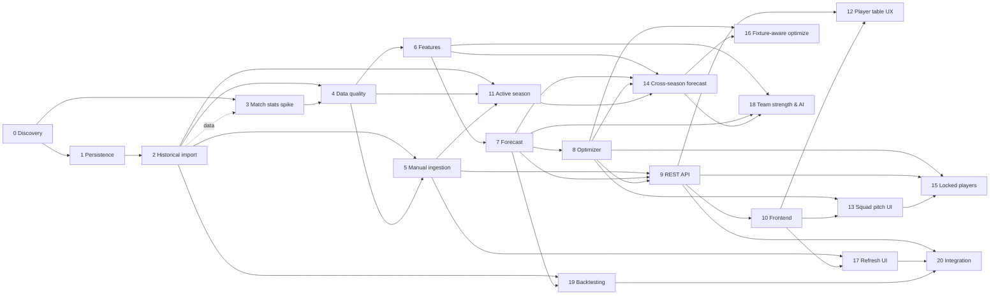

# План дальнейшей разработки Fantasy Analytics

Обновлено: 2026-08-09  
Текущий прогресс: 13 из 21 шагов завершён.

## Цель

Построить локально запускаемую систему, которая по данным Fantasy РПЛ и
футбольной статистике Sports.ru прогнозирует очки игроков и предлагает состав
на следующий тур.

План является рабочим документом. Он содержит планирование, текущие статусы и
ключевые детали/нюансы каждого шага. Подробные карточки выполнения (даты, ветки,
commit/PR, команды проверок и их результаты) и журнал изменений статусов вынесены
в [`docs/development-history.md`](development-history.md).

## Зафиксированные решения

- Backend и аналитика: Python.
- Основная БД: PostgreSQL.
- Frontend: TypeScript и Next.js.
- Sports.ru GraphQL вызывается только сборщиком данных.
- Исходные ответы GraphQL сохраняются до нормализации.
- Обновление данных в первой версии запускается вручную.
- Планировщик и регулярные фоновые обновления пока не нужны.
- Правила состава, лимиты клуба и трансферов берутся из API, а не из констант.
- Авторизация и хранение cookies Sports.ru не входят в первую версию.
- Каждый расчёт прогноза должен иметь версию модели и snapshot входных данных.
- Деплой первой версии — на выделенный OVH VPS под управлением Dokploy
  (Docker Compose + Traefik), приложение на `fantasy.smokebeliu.com`.
- Автодеплой выполняется при мердже в ветку `develop` (CI-гейт на тестах,
  затем деплой-вебхук Dokploy).
- Приложение работает с несколькими сезонами: завершённый 2025/2026 (fantasy
  `59`, stat `rfpl_25-26`) — исторический источник, активный 2026/2027 (fantasy
  `75`, stat `rfpl_26-27`) — целевой турнир. Данные за прошлый и текущий сезон
  визуально и в API разделяются, источник каждого числа помечается.
- Прогноз на первый тур нового сезона строится по данным прошлого сезона через
  кросс-сезонную идентичность (`players.stat_player_id`, `clubs.stat_team_id`);
  ушедшие игроки исключаются, новички получают прайоры без истории.
- Сила команд выводится из положения в таблице и результатов (доступно в
  Sports.ru через `stat_season.stats`); букмекерских котировок в API Sports.ru
  на данный момент нет — их доступность выясняется отдельной discovery-задачей.
- Опциональные AI-коэффициенты матчей/команд версионируются и хранятся
  снапшотом, чтобы прогноз и подбор состава оставались воспроизводимыми.

## Протокол работы независимого агента

Каждому агенту передаётся только репозиторий и номер одного шага из этого
документа. Контекст предыдущих разговоров не требуется.

Перед реализацией агент обязан:

1. Прочитать `README.md`, `docs/data-model.md` и этот файл.
2. Проверить, что все зависимости шага имеют статус `DONE`.
3. Изменить статус шага на `IN_PROGRESS` в сводной таблице и в карточке шага.
4. Завести карточку выполнения в `docs/development-history.md` и заполнить дату
   начала и идентификатор агента или ветки.
5. Не включать задачи из последующих шагов.

### Пререквизит данных: пустая БД при старте агента

База PostgreSQL в облачном окружении **пуста при каждом старте нового
клауд-агента** (данные из snapshot не сохраняются между запусками). Поэтому
любой шаг, которому нужны доменные данные (матчи, игроки, статистика), обязан
сначала выполнить импорт из шага 2 — это неявная предпосылка всех шагов,
зависящих от содержимого БД:

```bash
PYTHONPATH=src python3 -m fantasy_analytics.db.cli upgrade      # схема
PYTHONPATH=src python3 -m fantasy_analytics.ingest_cli --season-name 2025/2026
```

Проверить наполненность можно так:
`PGPASSWORD=fantasy psql -h localhost -U fantasy -d fantasy -c "SELECT count(*) FROM matches;"`.
Если результат `0`, импорт нужно запустить заново перед началом работы.

После реализации агент обязан:

1. Выполнить все критерии приёмки шага.
2. Записать команды проверок и их результат в карточку шага
   (`docs/development-history.md`).
3. Обновить документацию, если изменились команды или архитектурные решения.
4. Установить статус `DONE` либо `BLOCKED` и добавить в этот файл раздел
   «Ключевые детали и нюансы» с важными решениями шага.
5. Для `DONE` указать в карточке дату, commit/PR и краткий фактический результат.
6. Для `BLOCKED` описать точную причину и необходимое действие.
7. Добавить строку в журнал изменений в `docs/development-history.md`.
8. Пересчитать общий прогресс и перевести доступные следующие шаги в `READY`.
9. Закоммитить обновление плана и истории вместе с результатом шага.

Шаг нельзя помечать `DONE`, если его тесты не проходят. Если реализация
отличается от плана, отклонение и причина фиксируются в карточке истории.

Статусы:

- `PLANNED` — зависимости ещё не завершены.
- `READY` — шаг можно отдавать независимому агенту.
- `IN_PROGRESS` — шаг закреплён за агентом.
- `BLOCKED` — обнаружен внешний или технический блокер.
- `DONE` — критерии приёмки выполнены.

## Сводная таблица

Незавершённые шаги (11–20) занумерованы по порядку приоритета: чем меньше номер,
тем важнее делать (см. раздел
[«Приоритизация оставшихся шагов»](#приоритизация-оставшихся-шагов)). Колонка
«Приоритет» показывает тир: `P0` — фундамент, `P1` — ядро ценности, `P2` —
усиление подбора, `P3` — продвинутая аналитика и эксплуатация. Приоритет
ортогонален статусу: он говорит «что важнее делать», статус — «можно ли уже
брать в работу».

| Шаг | Название | Зависимости | Приоритет | Статус |
| --- | --- | --- | --- | --- |
| 0 | Discovery-прототип и локальный Docker | — | — | `DONE` |
| 1 | Persistence layer и миграции | 0 | — | `DONE` |
| 2 | Полный исторический импорт | 1 | — | `DONE` |
| 3 | Исследование расширенной match-статистики | 0, 2 (данные) | — | `DONE` |
| 4 | Контроль качества и reconciliation | 2, 3 | — | `DONE` |
| 5 | Ручной ingestion job и backend-команда | 2, 4 | — | `DONE` |
| 6 | Аналитические признаки | 4 | — | `DONE` |
| 7 | Базовая модель прогноза | 6 | — | `DONE` |
| 8 | Оптимизатор состава | 7 | — | `DONE` |
| 9 | Пользовательский REST API | 5, 7, 8 | — | `DONE` |
| 10 | Аналитический frontend | 9 | — | `DONE` |
| 11 | Импорт активного сезона 2026/2027 и разделение сезонов | 2, 4, 5 | `P0` | `DONE` |
| 12 | Полная статистика в таблице игроков (сортировка по очкам, без фильтра по турам) | 9, 10 | `P1` | `DONE` |
| 13 | Раздел «Состав»: поле-схема, переключение вида, group-button фильтр | 8, 10 | `P1` | `READY` |
| 14 | Кросс-сезонный прогноз состава на первый тур | 6, 7, 8, 11 | `P1` | `READY` |
| 15 | Фиксация игроков и подбор оптимального состава под схему | 8, 9, 13 | `P2` | `PLANNED` |
| 16 | Учёт соперников следующего тура в оптимизации | 8, 14 | `P2` | `PLANNED` |
| 17 | Ручное обновление из frontend | 5, 10 | `P2` | `READY` |
| 18 | Сила команд и AI-коэффициенты | 6, 7, 14 | `P3` | `PLANNED` |
| 19 | Backtesting и сравнение моделей | 2, 7 | `P3` | `PLANNED` |
| 20 | Интеграционная сборка и эксплуатационная готовность | 9, 17, 19 | `P3` | `PLANNED` |



## Приоритизация оставшихся шагов

Приоритеты расставлены «по смыслу» относительно главной цели — помочь собрать
состав на новый турнир РПЛ 2026/2027 по данным прошлого сезона. Учтены три
фактора: вклад в цель (ценность), зависимости и риск/неопределённость.

### P0 — фундамент нового турнира

- **Шаг 11 (активный сезон 2026/2027).** Без импорта нового сезона и разделения
  сезонов недостижима сама цель: не на чем строить прогноз и состав. Уже `READY`,
  делать первым.

### P1 — ядро ценности (собрать состав + быстрые видимые улучшения)

- **Шаг 12 (UX таблицы игроков).** Быстрый видимый эффект и низкий риск: чинит
  сортировку по очкам и убирает лишний фильтр по турам. Уже `READY`.
- **Шаг 13 (переработка раздела «Состав»).** Ядро UX подбора состава (поле-схема,
  переключение вида, group-button фильтр). Уже `READY`.
- **Шаг 14 (кросс-сезонный прогноз).** Прямо реализует основную задачу
  пользователя — состав на 1-й тур из прошлогодних данных с учётом ушедших и
  новых игроков. Зависит от 11.

P1-шаги 12 и 13 не зависят от 11/14 и могут выполняться параллельно с
фундаментом; 14 стартует сразу после 11.

### P2 — усиление подбора состава

- **Шаг 15 (фиксация игроков).** Явно запрошенная функция; сильно повышает
  практическую пользу подбора. Зависит от нового UI (13).
- **Шаг 16 (учёт соперников).** Улучшает качество оптимизации на очных встречах.
  Зависит от кросс-сезонного прогноза (14).
- **Шаг 17 (ручное обновление из frontend).** Операционное удобство: в идущем
  сезоне данные обновляются каждый тур. Не блокирует цель (обновление доступно
  через админ-API/CLI), поэтому ниже ядра ценности, но выше продвинутой
  аналитики.

### P3 — продвинутая аналитика и эксплуатация

- **Шаг 18 (сила команд и AI-коэффициенты).** Наибольшая сложность и
  неопределённость (нужна discovery по котировкам, опциональный AI-слой); даёт
  прирост качества поверх уже работающего подбора.
- **Шаг 19 (backtesting).** Внутренняя валидация модели, не виден пользователю
  напрямую; ценен для доверия к прогнозу, но не блокирует сбор состава.
- **Шаг 20 (интеграционная готовность).** Деплой уже работает; остаётся добить
  операционку (graceful shutdown, structured logs, smoke-test). Финальный
  «полировочный» шаг, зависит от 17 и 19.

### Рекомендованный порядок

`11 → 12 → 13 → 14 → 15 → 16 → 17 → 18 → 19 → 20` — нумерация теперь совпадает с
приоритетом. 12 и 13 — готовые к работе быстрые улучшения (можно вести
параллельно с 11); 14 выполняется сразу после появления активного сезона (11).

## Шаги

Для завершённых шагов ниже приведены только цель, зависимости и ключевые
детали/нюансы. Полные карточки выполнения — в
[`docs/development-history.md`](development-history.md).

Шаги идут строго по порядку номеров: завершённые (0–10) — по порядку выполнения,
незавершённые (11–20) — по приоритету (см.
[«Приоритизация оставшихся шагов»](#приоритизация-оставшихся-шагов)).

### Шаг 0. Discovery-прототип и локальный Docker

Статус: `DONE`

Цель: подтвердить доступность данных Sports.ru и сформировать первичную модель
данных.

Ключевые детали и нюансы:

- CLI для live GraphQL discovery; подтверждены 16 клубов, 30 туров, 240 матчей и
  590 fantasy-записей сезона 2025/2026.
- Ограничения API зафиксированы в `docs/data-model.md`.
- Docker daemon в облачном окружении агента отсутствует — полный запуск Compose
  подтверждается локально.

### Шаг 1. Persistence layer и миграции

Статус: `DONE`

Цель: заменить файловые артефакты полноценной записью нормализованных данных в
PostgreSQL.

Зависимости: шаг 0.

Ключевые детали и нюансы:

- Модели SQLAlchemy 2 (`db/models.py`) — единственный авторитетный источник
  схемы; `schema/postgres.sql` удалён.
- Alembic; драйвер psycopg 3 (`postgresql+psycopg://`); чистая БД одной командой
  `fantasy-migrate upgrade`. Последующие миграции — `alembic revision
  --autogenerate`.
- `IngestionRepository` (`db/repository.py`) транзакционно ведёт статусы
  `ingestion_runs` и идемпотентно пишет `raw_api_responses` (dedup по SHA-256).

### Шаг 2. Полный исторический импорт

Статус: `DONE`

Цель: загрузить прошлый сезон в PostgreSQL на уровне сезона, тура, матча, клуба
и каждого игрока.

Зависимости: шаг 1.

Ключевые детали и нюансы:

- Двухстадийный импортёр (`ingestion.py`): fetch всех страниц с retry/backoff,
  persist в одной транзакции; каталог upsert'ится идемпотентно по внешним id,
  снапшоты версионируются по run.
- Маппинг команд: в `season.tours.matches` приходят stat-слаги, в истории игрока
  — fantasy-id; строятся оба (`stat_team_id→club`, `fantasy_team_id→season_club`).
- Ингест-ран фиксируется отдельной транзакцией от доменного snapshot — при сбое
  частичные данные не публикуются.
- История грузится только для игроков с `fieldMinutes > 0`.
- `fantasy_point_details` пусты: `statDetails` в завершённых матчах пуст (маппинг
  готов и активируется, когда поле начнёт заполняться).

### Шаг 3. Исследование расширенной match-статистики

Статус: `DONE`

Цель: определить, какие футбольные показатели Sports.ru стабильно отдаёт для
матчей РПЛ.

Зависимости: шаг 0. Пререквизит данных: импорт шага 2.

Ключевые детали и нюансы:

- Матч резолвится через `statQueries.football.match(id)` по
  `matches.stat_match_id` без аргумента `source`.
- Надёжны командные удары, владение, угловые, фолы и составы; xG и большинство
  продвинутых по-игроцких метрик ненадёжны и исключены. По-игроцки надёжны
  только голы, карточки, автоголы и созданные моменты.
- Схема БД не менялась (спайк-исследование); предложение по хранению расширенной
  статистики — в `docs/data-model.md` и снимок покрытия в
  `docs/match-stats-coverage.md`.

### Шаг 4. Контроль качества и reconciliation

Статус: `DONE`

Цель: автоматически обнаруживать неполные или противоречивые данные до
аналитических расчётов.

Зависимости: шаги 2 и 3.

Ключевые детали и нюансы:

- Gate `fantasy-quality` (`quality.py`): формализованные blocking/warning
  проверки, нарушения в `data_quality_issues`; snapshot активируется
  (`ingestion_runs.is_active`) только при 0 blocking; ≤1 активный run на сезон
  (частичный unique-индекс).
- Reconciliation клубов и игроков; расхождения внутри 72-часового окна
  корректировки Sports.ru понижаются с `blocking` до `warning`.
- **Важно:** начальная миграция `0001` переписана со «живого»
  `metadata.create_all` на статичный baseline — иначе аддитивные миграции падали
  с `DuplicateTable`. Модели остаются источником схемы, следующие миграции —
  autogenerate.
- `data_quality_issues` перезаписывается целиком на каждый прогон
  (идемпотентность).

### Шаг 5. Ручной ingestion job и backend-команда

Статус: `DONE`

Цель: запускать полное обновление по запросу, без scheduler.

Зависимости: шаги 2 и 4.

Ключевые детали и нюансы:

- FastAPI `fantasy-api` (`api.py`): `POST /admin/ingestion/rpl/refresh` →
  `202`+id (или `409` при активном задании), `GET /admin/ingestion/runs/{id}`,
  `GET /health`. Таблица `ingestion_jobs` (миграция `0003`) — статус переживает
  рестарт API.
- Worker — отдельный `subprocess` (`start_new_session=True`), чтобы импорт
  переживал рестарт API; ядро вынесено в `execute_job`, запуск инъектируется
  (`spawn_worker`).
- Взаимное исключение без Redis: частичный unique-индекс + session-level
  `pg_try_advisory_lock`. Ошибки — с редакцией кредов (`safe_error_message`).

### Шаг 6. Аналитические признаки

Статус: `DONE`

Цель: построить воспроизводимый dataset для прогноза следующего тура.

Зависимости: шаг 4.

Ключевые детали и нюансы:

- `features.py` строит leakage-free dataset из активного snapshot (или
  `--run-id`); cutoff = `transfers_deadline_at` (fallback `starts_at`, затем
  ранний kickoff); матчи целевого тура дополнительно исключаются из истории.
- Признаки: rolling 3/5/10, per-90, сила атаки/защиты клуба и соперника, дни
  отдыха, доступность, отдельно `p_appearance` и `expected_minutes`.
- «Старт» аппроксимируется порогом `field_minutes >= 60` (явного флага состава
  в БД нет).
- Схема БД не менялась: dataset воспроизводим из `(run_id, tour,
  feature_version)` и пишется артефактами; словарь — в
  `docs/feature-dictionary.md`.

### Шаг 7. Базовая модель прогноза

Статус: `DONE`

Цель: получить ожидаемые fantasy-очки каждого доступного игрока следующего тура.

Зависимости: шаг 6.

Ключевые детали и нюансы:

- `forecast.py`: интерпретируемая событийная модель `poisson_events` из
  feature-датасета плюс baseline `season_mean` и `recent_form`.
- Голы команд — Poisson из венью-силы; вероятность сухого матча = `exp(-λ)`;
  вклад событий — из per-90 рейтингов × ожидаемые минуты.
- Таблица начисления `SCORING` (`scoring_version = rpl-2025-2026.1`)
  восстановлена из авторитетных матчевых `points` (правила в API — только
  картинка, `statDetails` пуст); точность реконструкции 83% точно / 96% ±1.
  `expected_points` = сумма `components`.
- Таблица `player_forecasts` (миграция `0004`), запись идемпотентна;
  `features.py` расширен per-90 сейвов/возвратов/жёлтых, `FEATURE_VERSION` →
  `1.1.0`.

### Шаг 8. Оптимизатор состава

Статус: `DONE`

Цель: выбрать валидные 15 игроков, стартовый состав, капитана и скамейку.

Зависимости: шаг 7.

Ключевые детали и нюансы:

- `optimizer.py`: целочисленная модель OR-Tools CP-SAT. Переменные
  `pick`/`start`/`captain`; objective = очки старта + капитан (удваивается) со
  строгим tie-break, минимизирующим расход бюджета. Вице — лучший из оставшихся
  стартовых, скамейка упорядочена по очкам (запасной вратарь в конце).
- Лимиты берутся из БД: бюджет и позиционные лимиты из `season_rules`, клубный
  лимит и лимит трансферов из `fantasy_tours` — ничего не захардкожено.
- Режимы `squad` (новый состав) и `transfers` (не более лимита тура;
  `--max-transfers` переопределяет). Независимый `validate_squad`; неразрешимая
  задача — понятный `OptimizerError`.
- Детерминизм: один search-worker, фиксированный seed, детерминированный порядок
  кандидатов. Добавлена зависимость `ortools`; таблиц не добавляет (артефакт
  `optimizer.json`).

### Шаг 9. Пользовательский REST API

Статус: `DONE`

Цель: предоставить frontend стабильный read API для аналитики и оптимизации.

Зависимости: шаги 5, 7 и 8.

Ключевые детали и нюансы:

- Read-слой `read_repository.py` (`ReadRepository`) отдаёт только из PostgreSQL;
  каталог (сезоны, туры, матчи, игроки, клубы) доступен всегда, изменяемые числа
  (цена, доступность, владение, сезонный счёт) — из **активного** snapshot,
  projections и компоненты — из персистентной `player_forecasts` (шаг 7).
- Endpoints (`api.py`, версия приложения `0.2.0`): `GET /seasons[/{id}]`,
  `/tours[/{id}]`, `/matches[/{id}]`, `/players[/{id}]`, `POST /optimizer/squad`
  и `/optimizer/transfers`; админ-эндпоинты шага 5 сохранены в том же приложении.
- Фильтры игроков: `role`, `club_id`, `status`, `min_price`/`max_price`,
  сортировка `order` (`projection`/`price`/`name`/`selected_by`). Projections
  подключаются по `tour_id`+`model` и несут версии модели/признаков/начисления.
- Контракты — Pydantic (`api_schemas.py`); пагинация с верхним лимитом
  (`limit ≤ 200`, `offset ≥ 0`) и детерминированным порядком (tie-break по
  `player_season_id`); единый конверт ошибок
  `{"error": {type, message, details}}` для HTTP- и validation-ошибок.
- OpenAPI генерируется из живого приложения без обращения к БД
  (`openapi_cli.py`, скрипт `fantasy-openapi`) и зафиксирован в
  `docs/openapi.json`. Схема БД не менялась.
- Ошибки оптимизатора (`OptimizerError`) отображаются в `422`
  (`type=optimizer_error`); read-эндпоинты никогда не вызывают Sports.ru GraphQL.

### Шаг 10. Аналитический frontend

Статус: `DONE`

Цель: показать данные следующего тура и позволить собрать состав.

Зависимости: шаг 9.

Ключевые детали и нюансы:

- Next.js 15 (App Router) + TypeScript в `frontend/`. Все запросы браузера идут
  same-origin через прокси `/api/backend/*` (rewrite в `next.config.mjs` на
  `BACKEND_URL`) — CORS не нужен; server-компоненты обращаются к backend напрямую
  по `BACKEND_URL`. TS-типы и API-клиент повторяют `docs/openapi.json`.
- Страница тура: селектор тура, таблица игроков с фильтрами (позиция, клуб,
  статус, диапазон цены), серверная сортировка (`order`), пагинация с верхним
  лимитом и сравнение до 4 игроков. Карточка игрока (drawer + маршрут
  `/players/[id]`) показывает историю матчей и разложение прогноза по компонентам
  начисления. Свежесть снапшота и версия модели — в шапке.
- Конструктор состава валидирует все правила ростера на клиенте (`lib/squad.ts`:
  размер, позиционные лимиты, бюджет, клубный лимит, дубли), зеркаля
  `optimizer.parse_role_limits`; отправка трансферов заблокирована до валидного
  состава из 15 игроков. Кнопка «Автосостав» вызывает `/optimizer/squad`, режим
  трансферов — `/optimizer/transfers`; результат оптимизатора автоматически
  загружается в конструктор, чтобы сводка оставалась согласованной.
- Дефолтный тур = следующий несыгранный, иначе последний (сезон завершён). Для
  наполнения проекций нужен предварительный `fantasy-forecast --tour <id>`
  (в демо — туры 15 и 30). Состояния loading/empty/error покрыты во всех вью,
  вёрстка адаптивная (desktop/mobile).
- Тесты: Vitest (25, unit-логика валидации + компоненты) и Playwright e2e
  (6 сценариев против живого backend). Compose расширен сервисами `api` и
  `frontend`; для фронтенда — standalone `Dockerfile`.

Не входит: ручное обновление данных и авторизация (шаг 17).

### Шаг 11. Импорт активного сезона 2026/2027 и разделение сезонов

Статус: `DONE`

Цель: завести в системе активный сезон РПЛ 2026/2027 (fantasy `75`, stat
`rfpl_26-27`) рядом с завершённым 2025/2026, чтобы приложение работало с
несколькими сезонами и явно различало исторические и текущие данные (запрос 1).

Зависимости: шаги 2, 4 и 5. Пререквизит данных: импорт шага 2.

Детали:

- Импортёр сейчас грузит конкретный сезон по имени (`fantasy-ingest
  --season-name 2025/2026`). Добавить импорт активного сезона (`75` /
  `rfpl_26-27`) и убедиться, что каталог, цены игроков и туры подтягиваются.
- В начале сезона сыгранных матчей ещё нет: quality gate и публикация снапшота
  должны корректно проходить на «пустом» расписании (клубы, туры, цены есть,
  истории матчей нет) — часть blocking-проверок (`match_score_completeness`,
  reconciliation) должна деградировать до warning или пропускаться для несыгранных
  туров, не роняя снапшот.
- API и фронт должны знать активный (`seasons.is_active`) и исторический сезон и
  уметь отдавать оба; ответы помечают, к какому сезону относятся числовые данные.
- Проверить кросс-сезонные ключи: `players.stat_player_id` и `clubs.stat_team_id`
  как основа для связки прошлого и нового сезона (нужно шагу 14).

Критерии приёмки:

- Импорт активного сезона завершается, публикуется активный снапшот.
- `GET /seasons` возвращает оба сезона с корректными флагами `is_active`.
- Пустое расписание нового сезона не роняет quality gate.
- Каждый мутируемый показатель в ответе API однозначно привязан к сезону.

Ключевые детали и нюансы (итог реализации):

- Импорт активного сезона уже поддержан флагом `fantasy-ingest --current`
  (или `--season-id 75` / `--season-name 2026/2027`); отдельного кода выбора не
  потребовалось. Расписание нового сезона публикуется заранее: импорт даёт 16
  клубов, 30 туров, 240 матчей и 438 игроков.
- **Главный дефект и фикс.** Для несыгранного матча Sports.ru отдаёт `score: 0`
  (а не `null`), поэтому старый импортёр записывал все 240 матчей нового сезона
  как сыгранные вничью 0:0 — это ломало силу команд, форму и reconciliation
  (16 warnings, а после 72ч-окна 1-го тура стало бы blocking и снапшот перестал
  бы публиковаться). Введено поле `matchStatus` в `SEASON_QUERY` и хелпер
  `discovery._is_match_finished` (сыгранный = `CLOSED`); несыгранные матчи
  пишутся с `NULL` счётом и `NULL` голами в `club_match_stats`,
  `_derive_team_match_stats` их пропускает. Схема БД не менялась (поля
  счёта/голов уже nullable).
- Разделение сезонов уже обеспечено моделью: частичный unique-индекс даёт ≤1
  активный снапшот на сезон, `GET /seasons` отдаёт оба сезона с корректными
  `is_active` и отдельными `snapshot.run_id`; `read_repository` резолвит активный
  ран по каждому сезону. Фронтенд по умолчанию выбирает активный сезон
  (сортировка сезонов + `limit:1`).
- Проверено end-to-end на живом API: активный сезон импортируется и публикуется
  без blocking/warning; при совместном импорте с завершённым 2025/2026 API
  отдаёт оба сезона с раздельными активными снапшотами.

Не входит: кросс-сезонный прогноз (шаг 14); явный селектор сезона и визуальное
разделение статистики в UI (шаги 12–14).

### Шаг 12. Полная статистика в таблице игроков

Статус: `DONE`

Цель: показать в таблице игроков полную статистику на текущий момент, починить и
ускорить сортировку по очкам и убрать неинформативный фильтр по турам (запросы 3
и 4).

Зависимости: шаги 9 и 10.

Детали:

- **Сортировка по очкам (запрос 3).** Добавить ключ сортировки по сезонным очкам
  в read API (`PLAYER_ORDERS` в `read_repository.py`, сейчас
  `projection/price/name/selected_by` — очков нет) и сделать колонку «Очки» в
  `PlayerTable.tsx` кликабельной (сейчас у неё нет `order`). Устранить тормоза:
  каждая смена сортировки делает полный серверный запрос и сбрасывает offset —
  добавить индекс под сортировку, дебаунс и/или клиентскую пересортировку уже
  загруженной страницы.
- **Убрать фильтр по турам (запрос 4).** Выпадашку туров из тулбара таблицы
  (`TourExplorer.tsx`) удалить; по умолчанию показывать сезонные агрегаты (очки,
  форма, цена, владение) — «полную статистику на данный момент», а не срез по
  одному туру. Разбивку и данные по турам оставить только в детальной карточке
  игрока (`PlayerCard`/`/players/[id]`).
- Продумать судьбу тур-специфичной колонки «Прогноз»: проекции привязаны к туру,
  поэтому либо считать её для ближайшего (следующего) тура неявно, либо перенести
  тур-зависимые проекции в раздел «Состав».
- Визуально разделить историческую статистику прошлого сезона и статистику
  текущего сезона (бейдж/группировка), опираясь на источник из шага 14.

Критерии приёмки:

- Сортировка по очкам работает по клику на заголовок и не тормозит.
- Фильтр по турам удалён из таблицы игроков.
- Таблица по умолчанию показывает полную сезонную статистику.
- Карточка игрока по-прежнему показывает разбивку по турам.

Ключевые детали и нюансы (итог реализации):

- **Сортировка по очкам (запрос 3).** В read API добавлен ключ `season_score`
  (`PLAYER_ORDERS` и `_player_order` в `read_repository.py`: сортировка по
  `fantasy_player_snapshots.season_score DESC NULLS LAST` с tie-break по
  `player_season_id`); `PlayerOrder` в `api_schemas.py` и `docs/openapi.json`
  обновлены. В `PlayerTable.tsx` колонка «Очки» стала кликабельной.
- **Устранение тормозов.** Раньше каждая смена сортировки делала полный
  серверный запрос со сбросом offset. Теперь `TourExplorer.tsx` один раз грузит
  весь отфильтрованный сезонный набор (набор ограничен ≤590 строками, ≤3 запроса
  по 200), а сортировка и пагинация выполняются на клиенте (`lib/players.ts`
  `sortPlayers`) — переключение сортировки мгновенно и без обращения к серверу.
  Рефетч происходит только при смене фильтров/модели. Сортировка по умолчанию —
  по сезонным очкам.
- **Убран фильтр по турам (запрос 4).** Выпадашка туров удалена из тулбара
  таблицы; таблица показывает полную сезонную статистику «на данный момент»
  (очки, форма, цена, владение). Разбивка по турам осталась только в карточке
  игрока (`PlayerCard`/`/players/[id]`) — история матчей и разложение прогноза.
- **Судьба колонки «Прогноз».** Тур-специфичная проекция сохранена, но считается
  неявно для ближайшего (следующего несыгранного, иначе последнего) тура; заметка
  над таблицей поясняет, на какой тур рассчитан прогноз.
- **Разделение статистики прошлого/текущего сезона** отложено к шагу 14: источник
  (`stat_source`: `prior_season`/`current_season`) появляется там; отдельного поля
  в API пока нет, поэтому бейдж/группировку добавит шаг 14.
- **Тесты.** Vitest: `sortPlayers` (4 сценария) и кликабельность колонки «Очки» в
  `PlayerTable`. Playwright: отсутствие фильтра по турам + полная сезонная
  статистика и сортировка по очкам по клику (колонка «Очки» невозрастающая).

Не входит: изменения раздела «Состав» (шаг 13).

### Шаг 13. Раздел «Состав»: поле-схема, переключение вида, group-button фильтр

Статус: `READY`

Цель: переработать раздел «Состав» так, чтобы слева был состав в виде схемы на
поле (как на Sports) с переключением схема/список, а справа — поиск и список
всех игроков; фильтр по позиции сделать группой кнопок (запросы 5 и 6).

Зависимости: шаги 8 и 10.

Детали:

- **Двухколоночная раскладка (запрос 6).** Слева — текущий состав в виде схемы:
  игроки расположены на поле по позициям (использовать/расширить
  `OptimizerPitch.tsx`). Справа — поиск и список всех игроков (сейчас список
  слева в `SquadBuilder.tsx`).
- **Переключатель вида состава:** схема ↔ список.
- **Фильтр по позиции (запрос 5):** заменить `<select>` на группу кнопок (group
  button: GK / DEF / MID / FWD / Все) в разделе «Состав».
- Добавление/замена игрока должны работать и из схемы, и из списка справа;
  сводка правил ростера остаётся согласованной.
- Учесть разделение статистики прошлого/текущего сезона из шага 14 в карточках
  игроков на поле и в списке.

Критерии приёмки:

- Страница «Состав» разделена на две части: схема слева, поиск и список справа.
- Работает переключение «схема ↔ список».
- Фильтр по позиции реализован группой кнопок.
- Все правила ростера по-прежнему валидируются на клиенте.

Не входит: фиксация игроков и подбор под схему (шаг 15).

### Шаг 14. Кросс-сезонный прогноз состава на первый тур

Статус: `READY`

Цель: собрать состав на 1-й тур нового турнира, отталкиваясь от статистики
прошлого сезона, при этом учитывая, что часть игроков отсутствует, а часть —
новые (запрос 2), и визуально разделяя данные прошлого и текущего сезона
(запрос 1).

Зависимости: шаги 6, 7, 8 и 11.

Детали:

- Пока в активном сезоне нет сыгранных матчей, признаки (`features.py`) и прогноз
  (`forecast.py`) для игрока берутся из прошлого сезона по кросс-сезонной
  идентичности (`stat_player_id`), а сила/венью — из клуба активного сезона
  (`stat_team_id`) и его расписания туров.
- Ушедшие/не заявленные в активном сезоне игроки исключаются из пула кандидатов
  (нет `player_season` в новом сезоне).
- Новички (нет истории в прошлом сезоне) получают документированные прайоры по
  позиции/цене/клубу и явный флаг `has_history=false`, чтобы не занулять их
  молча; отдельно продумать перешедших между клубами игроков.
- В прогнозе/фиче помечать источник статистики: `prior_season` vs
  `current_season`, чтобы фронт (шаги 12–13) визуально отделял историческую
  статистику от собираемой в этом сезоне.
- По мере появления матчей нового сезона прогноз плавно переходит на текущие
  данные (blend или переключение источника по объёму истории).

Критерии приёмки:

- `fantasy-forecast` строит прогноз на тур 1 активного сезона из данных прошлого
  сезона.
- Ушедшие игроки отсутствуют в кандидатах, новички присутствуют с прайорами и
  флагом отсутствия истории.
- В каждой строке прогноза указан источник статистики (прошлый/текущий сезон).
- Оптимизатор собирает валидный состав на первый тур нового турнира.

Не входит: учёт соперников и силы команд (шаги 16 и 18).

### Шаг 15. Фиксация игроков и подбор оптимального состава под схему

Статус: `PLANNED`

Цель: дать возможность зафиксировать отдельных игроков, которых пользователь
точно хочет видеть в составе, и подобрать оптимальных остальных под его схему на
основе статистики (запрос 7).

Зависимости: шаги 8, 9 и 13.

Детали:

- В `optimizer.py` добавить `locked_ids` — принудительно включаемых игроков
  (`pick[i] == 1`, опционально `start[i] == 1` для фиксации именно в старте) с
  сохранением всех прочих ограничений (бюджет, роли, клубный лимит).
- Валидировать совместимость фиксаций с лимитами и бюджетом; при неразрешимости —
  понятный `OptimizerError` с указанием конфликтующего ограничения.
- Расширить `POST /optimizer/squad` (и при необходимости `/optimizer/transfers`)
  параметром `locked` и покрыть контрактом (`api_schemas.py`, OpenAPI).
- UI (раздел «Состав»): «пин» игрока на схеме/в списке и кнопка «подобрать
  оптимальных под мою схему», которая вызывает оптимизатор с зафиксированными
  игроками и заданной схемой/формацией.

Критерии приёмки:

- Зафиксированные игроки всегда присутствуют в решении оптимизатора.
- Остальные позиции заполняются оптимально в рамках правил.
- Несовместимый набор фиксаций возвращает понятную ошибку.
- Сценарий фиксации покрыт unit-тестом оптимизатора и e2e-тестом UI.

Не входит: учёт соперников и силы команд (шаги 16 и 18).

### Шаг 16. Учёт соперников следующего тура в оптимизации

Статус: `PLANNED`

Цель: учитывать при подборе состава, какая команда с кем встречается в следующем
туре, чтобы максимизировать очки и не брать конфликтующие ставки (запрос 8).

Зависимости: шаги 8 и 14.

Детали:

- Использовать календарь тура (пары матчей) в целевой функции оптимизатора: нет
  смысла одновременно брать вратаря/защиту одной команды и нападение другой, если
  они играют друг с другом — «сухарь» обороны и голы атаки соперника
  антикоррелированы.
- Смоделировать корреляцию исходов очной встречи: например, штраф за
  одновременный расчёт на clean sheet обороны команды A и на голы атаки команды
  B, когда в туре есть матч A vs B; либо совместное распределение голов пары
  вместо независимых ожиданий.
- Опираться на уже доступные в фиче поля соперника (`opponent_club_id`,
  `opponent_name`, `match_id`, `is_home`) и расписание тура из `matches`.
- Сохранить детерминизм и независимую валидацию решения.

Критерии приёмки:

- В очной встрече оптимизатор не берёт одновременно оборону одной стороны и атаку
  другой без чистой выгоды по ожидаемым очкам.
- Поведение подтверждено тестом на сконструированном примере пары команд.
- Эффект учёта календаря объясним в отчёте оптимизатора.

Не входит: коэффициенты силы команд и AI (шаг 18).

### Шаг 17. Ручное обновление из frontend

Статус: `READY`

Цель: дать пользователю безопасную кнопку обновления перед туром.

Зависимости: шаги 5 и 10.

Детали:

- Добавить административный экран обновления.
- Показывать этап, прогресс и время запуска job.
- Polling использовать только пока job не завершён.
- Блокировать повторный запуск при активном задании.
- После успеха обновлять данные и показывать новый snapshot.
- После ошибки показывать безопасное сообщение и возможность повтора.

Критерии приёмки:

- Кнопка запускает реальный ingestion job.
- Перезагрузка страницы не теряет состояние задания.
- Повторный клик не создаёт параллельный импорт.
- UI показывает последний успешный snapshot и целевой тур.
- Сценарии success/failure покрыты e2e тестом.

Не входит: scheduler и уведомления.

### Шаг 18. Сила команд и AI-коэффициенты

Статус: `PLANNED`

Цель: учитывать силу команд при оптимизации (сильнее команда — больше смысла
брать её атаку), проработать источники данных и, при необходимости, интеграцию с
AI для анализа предстоящих матчей (запрос 9).

Зависимости: шаги 6, 7 и 14.

Детали:

- **Что уже доступно в Sports.ru.** Командная таблица и результаты отдаются через
  `stat_season.stats(id, source: SPORTS_HUB)` (см. `queries.build_team_stats_query`:
  `MatchesPlayed/Won/Drawn/Lost`, `GoalsScored/Conceded`, `GroupPosition`,
  `CupRank`) и частично уже моделируются таблицей `club_season_stats`. Из этого
  можно вычислить положение в таблице, разницу мячей и форму → коэффициент силы
  команды. Это первоочередной, «бесплатный» источник.
- **Чего нет.** Букмекерских котировок в текущих GraphQL-запросах Sports.ru нет —
  поле не обнаружено. Нужна отдельная discovery-под-задача: проверить схему
  Sports.ru на наличие odds/котировок; если их нет — зафиксировать вывод и
  рассмотреть внешний источник котировок или оценку силы без них.
- **AI-интеграция (опционально).** Сервис, анализирующий предстоящие матчи
  (положение в таблице, форма, домашнее поле, при наличии — котировки) и
  выдающий доп-коэффициенты командам/матчам. Коэффициенты подмешиваются в силу
  атаки/защиты в `features.py`/`forecast.py`; их источник и версия хранятся
  снапшотом, чтобы прогноз оставался воспроизводимым (см. «Зафиксированные
  решения»).
- **Влияние на состав.** Сильная команда против слабой обороны → апсайд её
  атакующих; крепкая оборона против слабой атаки → апсайд «сухаря». Эти сигналы
  должны согласованно менять ожидаемые очки, а не хардкодиться в оптимизаторе.

Критерии приёмки:

- Коэффициент силы команды вычисляется из доступных данных (таблица/результаты) и
  версионируется.
- В плане/доке зафиксирован вывод о доступности букмекерских котировок в
  Sports.ru.
- Если добавляется AI-слой — его коэффициенты версионируются и воспроизводимы,
  прогноз на одном снапшоте детерминирован.
- Прогноз и подбор состава демонстрируемо реагируют на силу команд.

Не входит: полноценная модель ставок и live-обновление котировок.

### Шаг 19. Backtesting и сравнение моделей

Статус: `PLANNED`

Цель: проверить, улучшает ли прогноз выбор состава на исторических турах.

Зависимости: шаги 2 и 7.

Детали:

- Последовательно симулировать туры без доступа к будущим данным.
- Сравнить модель со средними очками, формой и value baseline.
- Измерять MAE/RMSE прогноза и очки оптимального состава.
- Отдельно оценивать позиции, стартовый состав и капитана.
- Сохранять параметры запуска и результаты.
- Добавить отчёт с ошибками и наиболее нестабильными признаками.

Критерии приёмки:

- Cutoff каждого тура проверяется автоматически.
- Результат воспроизводим одной командой.
- Есть сравнение минимум с двумя простыми baseline.
- Метрики представлены по турам и позициям.
- Вывод содержит решение: принять модель, изменить или оставить baseline.

Не входит: live A/B-тест.

### Шаг 20. Интеграционная сборка и эксплуатационная готовность

Статус: `PLANNED`

Цель: запускать полную первую версию локально и на одном сервере.

Зависимости: шаги 9, 17 и 19.

Детали:

- Расширить Compose сервисами API, worker, frontend и PostgreSQL.
- Добавить healthchecks, dependency ordering и graceful shutdown.
- Добавить CI для lint, unit, integration и frontend tests.
- Добавить миграции при развёртывании и проверку совместимости схемы.
- Документировать backup/restore и безопасные локальные secrets.
- Добавить structured logs и endpoint состояния компонентов.

Ключевые детали и нюансы (операционный трек, деплой развёрнут и работает):

Приложение развёрнуто на выделенном OVH VPS (`145.239.74.111`) под управлением <!-- pragma: allowlist secret -->
Dokploy и доступно на `https://fantasy.smokebeliu.com`. Полное руководство (DNS,
Dokploy, secrets, первичный импорт, smoke-тест, бэкапы) —
в [`docs/deployment.md`](deployment.md). Ниже — как это устроено и настроено.

Архитектура прод-стека (`compose.prod.yaml`):

- Сервисы: `postgres` (16-alpine, том `postgres_data`), одноразовый `migrate`
  (`fantasy-migrate upgrade` при каждом деплое), `api` (FastAPI, `:8000`,
  healthcheck) и `frontend` (Next.js, `:3000`).
- Публично через reverse-proxy Traefik (входит в Dokploy) доступен **только**
  `frontend`. Он подключён к внешней сети `dokploy-network` и несёт Traefik-метки:
  роутер на `Host(fantasy.smokebeliu.com)`, `entrypoints=websecure`,
  `certresolver=letsencrypt` (TLS от Let's Encrypt), плюс редирект http→https.
- `api` и `postgres` живут в приватной сети `fantasy-internal` и наружу не
  публикуются. Браузер ходит same-origin через `/api/backend/*`, который
  Next.js проксирует на `http://api:8000` внутри приватной сети.
- Домен и TLS заданы метками в compose, отдельно во вкладке Domains в Dokploy
  ничего добавлять не нужно.

Конфигурация Dokploy:

- Тип приложения — **Compose**, provider **GitHub**, ветка `develop`,
  Compose Path `compose.prod.yaml`.
- Переменные окружения (`.env.prod.example`): `POSTGRES_DB`, `POSTGRES_USER`,
  `POSTGRES_PASSWORD` (обязателен, дефолта нет), `FRONTEND_DOMAIN`.

CI/CD и автодеплой при мердже в `develop`:

- `.github/workflows/ci-cd.yml`: на PR/пуш в `develop` прогоняются тесты
  backend (`unittest` + сервис PostgreSQL) и frontend (typecheck, vitest,
  build); при мердже в `develop`, если тесты зелёные, job `deploy` дёргает
  деплой-вебхук Dokploy (секрет GitHub `DOKPLOY_DEPLOY_WEBHOOK`), Dokploy
  забирает `develop` и пересобирает стек. Проверено сквозняком.

Важный нюанс сборки frontend:

- `next.config.mjs` вычисляет `rewrites()` (прокси `/api/backend/*`) на этапе
  **сборки** и «запекает» destination в манифест. Поэтому `BACKEND_URL` задаётся
  в `frontend/Dockerfile` (builder-стадия, через `ARG`, дефолт `http://api:8000`)
  **до** `npm run build` — иначе прокси браузера уходит в localhost и все
  `/api/backend/*` отвечают 500. Server-компоненты читают `BACKEND_URL` в
  рантайме, поэтому от рантайм-переменной зависит только серверный рендер.

Первичное наполнение прод-БД (данные пусты после чистого деплоя):

- Миграции применяются автоматически (`migrate`). Затем внутри контейнера `api`:
  `fantasy-ingest --season-name 2025/2026` → `fantasy-quality` (публикует
  snapshot) → `fantasy-forecast --tour <fantasy_tour_id>`. Сезон 2025/2026
  завершён, поэтому `--tour` обязателен и задаётся именно `fantasy_tour_id` тура
  (не порядковым номером). Проверено на проде: сезон, туры, игроки и проекции
  отдаются через API.

Ещё не сделано в рамках полного шага 20 (поэтому статус — `PLANNED`): graceful
shutdown и structured logs, проверка совместимости схемы при деплое, кнопка
обновления данных из UI (шаг 17), backtesting (шаг 19) и smoke-test первой
версии в README. Автодеплой-часть и развёртывание на сервере — выполнены.

Критерии приёмки:

- Чистый checkout запускается документированной командой.
- Пользователь может обновить данные и получить состав через UI.
- Перезапуск контейнеров не теряет БД и job status.
- CI проходит на чистом окружении.
- README содержит полный smoke-test первой версии.

Не входит: Kubernetes, autoscaling и многопользовательская SaaS-эксплуатация.
